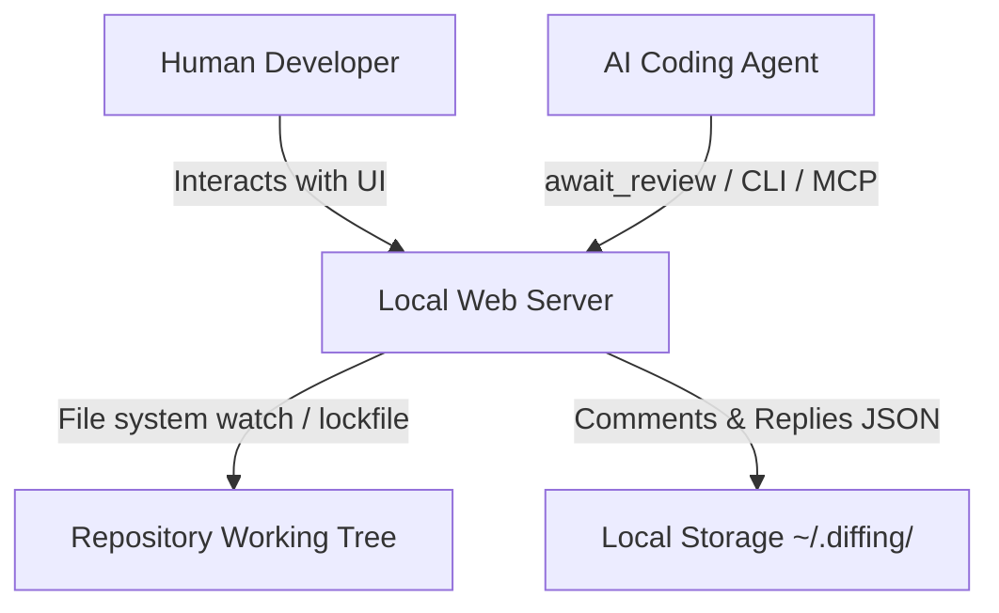

# Diffing CLI Reference Manual

> **Public docs:** this long-form manual is retained for contributors during cutover.
> Canonical navigable documentation: [CLI reference on the docs site](https://ahmedragab20.github.io/diffing/docs/reference/cli/) · [full site](https://ahmedragab20.github.io/diffing/).

This manual provides a detailed technical reference for the `diffing` command-line interface, its Model Context Protocol (MCP) server, and the underlying agent-user handoff protocol.

---

## 1. Core Concepts & Architecture

`diffing` is designed as a local-first, double-sided utility that serves both human developers and AI coding agents.



### Output Mode Auto-Detection

The primary `diffing` command determines how to output diff results based on whether stdout is interactive (a TTY) or a pipe/redirect:

- **Preferred interactive mode** (Default: Web): Uses the `web` or `tui` preference stored in `~/.config/diffing/settings.json`. Change it with `diffing mode <web|tui>`.
- **Terminal Mode** (Default for pipes, redirects, or non-TTY outputs): Behaves exactly like `git diff`. The command outputs standard patch text directly to stdout and exits.
- **Viewer Mode** (Explicit `view` / `--view`): Opens a focused, read-only native TUI for browsing an interactive diff. This mode is intended as the ergonomic replacement for an interactive `git diff`.

You can explicitly select a mode using a command or flag:

- `--web`: Forces the launching of the web review server.
- `--terminal`: Forces standard `git diff` output to terminal.
- `view` / `--view`: Opens the read-only native diff viewer.
- `--tui`: Opens the full native review surface, including comments and handoff.

Explicit mode flags override the saved preference. The preference does not
change the web default for GitHub PR reviews, and output-format flags still
force terminal mode.

*Note: Any output format control flags (e.g. `--raw`, `--numstat`, `--stat`, `--exit-code`, `--quiet`, or `--output`) will implicitly force Terminal Mode.*

---

## 2. Multi-Session Discovery

Every web, TUI, or GitHub PR review registers a lightweight record under a
repository-specific `sessions/` directory. `server.json` remains a
backward-compatible pointer to the **active** session: existing agent commands
still discover one port without hardcoding it, while multiple review surfaces
can run concurrently.

The newest launch becomes active. Use `diffing sessions use <id>` to retarget
`url`, `comments`, `inspect`, plan commands, and MCP discovery to another live
session.

### The Lockfile Location

The storage directory is computed by hashing the absolute path of the repository root:

```text
~/.diffing/<repo-name>-<sha256(repo-root-path).slice(0, 8)>/
├── server.json                 # active-session pointer
└── sessions/<session-id>.json  # one record per live session
```

### Lockfile Schema

```json
{
  "port": 3433,
  "host": "127.0.0.1",
  "pid": 45192,
  "repoRoot": "/Users/developer/projects/my-app",
  "startedAt": 1782782782782,
  "version": "0.1.0",
  "sessionId": "7739b322-3a30-4bb1-8448-8f550627ad04",
  "mode": "web" | "tui" | "gh-pr",
  "prRef": "https://github.com/ahmedragab20/diffing/pull/1234"
}
```

- `mode` — `"web"` (default, local diff review), `"tui"` (Rust terminal UI), or `"gh-pr"` (GitHub PR review). Lets client subcommands detect a PR session without a port round-trip.
- `sessionId` — public lifecycle identifier used by `diffing sessions`; it is
  separate from the TUI's private API capability.
- `prRef` — present only when `mode === "gh-pr"`. The original `gh pr <ref>` input as the user typed it, for diagnostic round-trips.

### Self-Healing & Validation

To ensure stale lockfiles from terminated or crashed server processes do not block the CLI, client subcommands check the lock's validity via `isLockAlive`:

1. It probes the process using `process.kill(pid, 0)` (which checks for process existence without sending a termination signal).
2. It validates that the repository path registered in the lockfile matches the repository context of the executing CLI process.

Records whose owner process has exited are pruned automatically. A live owner
that misses a health probe is retained as temporarily unresponsive, preventing
a slow review from becoming an undiscoverable orphan. If the active session
exits, the newest remaining live session is elected and written to
`server.json`.

---

## 3. Command Line Interface Reference

### `diffing` (Primary Command)

Launches the preferred interactive review UI or outputs terminal diffs. It serves as a drop-in replacement for `git diff` and accepts all standard git revisions, options, and pathspecs.

```bash
diffing [options] [<revision>...] [-- <path>...]
```

#### Diffing Server Options

- `--port <port>`: The port to bind a new server to. If omitted, the OS assigns an available port atomically. A compatible live session is reused before any bind is attempted.
- `--host <host>`: Host address to bind the server to (default: `127.0.0.1`). Loopback binds generate a per-session API token stored in the server lockfile; the web UI authenticates via an HttpOnly cookie (set when HTML is served) and optional `x-diffing-token` header on fetch. CLI and MCP read the token from the lockfile and send the header. Browseable URLs never include `?token=`. To expose the dashboard on your LAN, pass `0.0.0.0` together with `--insecure-no-auth` (disables API authentication).
- `--insecure-no-auth`: Required when binding to a wildcard address (`0.0.0.0` or `::`). Disables API authentication entirely when supplied — including on loopback binds, where tokens are otherwise issued. This is an explicit, unsafe opt-out for trusted networks only.
- `--no-open`: Prevents the CLI from automatically launching your browser when the server starts.
- `--reuse-session`: Open the active session (print URL / launch browser), regardless of its scope.
- `--replace-session`: Stop the active session and start a replacement with the current arguments.
- `--new-session`: Always start a separate review, even when an identical mode and scope are already live.
- `--gh-pr <ref>`: Open a GitHub PR review session instead of a working-tree diff. The `<ref>` accepts the same forms as `gh pr <ref>` (bare number, `owner/repo#N`, or full GitHub URL). Equivalent to the quoted form `diffing "gh pr <ref>"`. See [§4c. GitHub PR Review Subcommands](#4c-github-pr-review-subcommands) for the full flow.
- `--view`: Open the focused, read-only native diff viewer. Equivalent to `diffing view`.
- `--tui`: Open the opt-in native-Rust terminal UI instead of the web server when a compatible `diffing-tui` executable has been installed or built. The same review flow (diff render, file tree, comments, agent handoff) runs in your terminal — no browser. You can also make it the interactive default with `diffing mode tui`. See [§4d. TUI Subcommands (Native Terminal UI)](#4d-tui-subcommands-native-terminal-ui) for installation, fallback, and the full flow.

#### Server security

- Loopback binds reject non-loopback `Host` headers on HTML and API routes. Any supplied `Origin` must match the request origin; mismatches return `403`, including on reads and bootstrap pages.
- Responses use `Cache-Control: no-store`, `X-Content-Type-Options: nosniff`, and `Referrer-Policy: no-referrer`.
- With authentication enabled on a non-loopback bind, HTML and deep links require the session header or cookie. Unauthenticated requests return `401` without a credential in the body or cookies. There is no automatic unauthenticated LAN bootstrap.
- Loopback browser bootstrap is unchanged. The browser fetch wrapper adds `x-diffing-token` only to same-origin `/api/` requests and preserves existing request headers.
- `--insecure-no-auth` disables authentication, not Host/Origin checks. Use loopback unless you explicitly intend to expose an unauthenticated review server.

#### Concurrent session lifecycle

Starting `diffing`, `diffing --web`, `diffing --tui`, or a GitHub PR review is
idempotent by default: the newest compatible live session is selected and
opened instead of allocating another port. Compatibility includes mode, diff
scope, bind host, an explicitly requested port, and PR ref where applicable.
Different scopes and modes still coexist and receive separate registry records.
Web and PR reuse also verifies that the HTML review shell is available; an
API-only process with a missing client bundle is reported instead of opened.
If a matching owner process is alive but its API is temporarily unresponsive,
the CLI refuses to allocate another port and explains how to retry or opt into
`--new-session`.

- Pass `--reuse-session` to open the active review even when it does not match
  the requested scope.
- Pass `--replace-session` to stop only the active review before launching.
- Pass `--new-session` to deliberately create another session for an already
  live scope.
- Use `diffing sessions` to list, select, open, or stop a specific session.
- MCP `start_review_session` remains conservative: it never stops or replaces
  a user-owned session and reports incompatible active scope/mode conflicts.

`--reuse-session`, `--replace-session`, and `--new-session` are mutually
exclusive.

#### First-run setup gate

On an interactive TTY, when `setupCompletedAt` is unset in
`~/.config/diffing/settings.json`, the primary command prints a welcome prompt
before starting a review:

```text
[Y] Run setup now   [n] Skip   [?] Docs
```

- **Y** — runs the `diffing setup` wizard, then continues (if inside a Git repo).
- **n** — continues without setup.
- **?** — prints the getting-started doc URL.

Bypass the gate with `--skip-setup`. CI and non-TTY environments never show the
prompt. See **[getting-started.md](getting-started.md)** and **`setup`** below.

#### Git-Compatible Flags Supported

- **Revisions / Range**: `--staged`, `--cached`, `--merge`
- **Diff Algorithms**: `--diff-algorithm=<algo>` (`minimal`, `patience`, `histogram`, `myers`), `--indent-heuristic`, `--no-indent-heuristic`, `--anchored=<text>`
- **Whitespace Controls**: `-b`/`--ignore-space-change`, `-w`/`--ignore-all-space`, `--ignore-blank-lines`, `--ignore-cr-at-eol`, `--ws-error-highlight=<kind>`
- **Context Lines**: `-U<n>`/`--unified=<n>`, `--inter-hunk-context=<n>`, `-W`/`--function-context`
- **Word-Level Diffs**: `--word-diff=<mode>` (`color`, `plain`, `porcelain`, `none`), `--word-diff-regex=<regex>`, `--color-words[=<regex>]`
- **Moved/Copied Detection**: `--color-moved=<mode>`, `--color-moved-ws=<mode>`, `-C`/`--find-copies`, `--find-copies-harder`, `-M`/`--find-renames`, `-B`/`--break-rewrites`
- **Output Formats**: `-p`/`--patch`, `-s`/`--no-patch`, `--raw`, `--numstat`, `--shortstat`, `--stat`, `--summary`, `--name-only`, `--name-status`, `--check`
- **Filtering**: `--diff-filter=<filter>`, `-S<string>`, `-G<regex>`, `--pickaxe-all`
- **Output Control**: `-o <file>`/`--output=<file>`, `--exit-code`, `--quiet`

---

## 4. Agent-Facing Subcommands

A specialized suite of subcommands is integrated into the `diffing` binary to coordinate handoffs and synchronize review cycles. These commands automatically discover the active server via the lockfile.

| Subcommand | Role |
| ------------ | ------ |
| `await-review` | Block until human **Send to agent** |
| `comments` | Snapshot comments (XML / JSON / Markdown) |
| `reply` / `resolve` / `unresolve` | Thread lifecycle |
| `comment edit` / `comment delete` | Mutate a thread body or delete it |
| `progress` | Live agent progress toast |
| `url` | Active server base URL |
| `sessions …` | List, select, open, and stop live sessions |
| `plan …` | Plan-review loop (see §4b) |
| `mockup …` | Mockup-review loop (see §4b2) |
| `gh …` | GitHub PR automation (see §4c) |
| `mcp` | Stdio MCP server (see §5) |
| `inspect …` | Bounded web, TUI, or PR diff reads (see below) |
| `mode [web\|tui]` | Get or set the default interactive review mode |
| `setup` / `init` / `onboard` | First-time setup wizard (see below) |
| `doctor` / `completion` / `update` | DX |

### `sessions`

Repository-local task manager for live web, TUI, and GitHub PR reviews:

```bash
diffing sessions                       # Table; * marks the active target
diffing sessions --json                # Script-safe summaries (no capabilities)
diffing sessions use <id>              # Make a session active for agent commands
diffing sessions open [<id>|active]    # Select and open/print a session
diffing sessions stop <id>|active|all  # Graceful stop, then force if necessary
diffing sessions kill <id>|active|all  # Force a recorded unreachable PID when needed
```

The first eight characters shown in the table are accepted when they uniquely
identify a session. Sessions whose process exists but whose loopback API does
not answer remain visible as `unreachable`. `stop` keeps the conservative API
identity check; explicit `kill` force-stops the recorded PID and also repairs an
orphaned startup lease when used with `all`. Stopping the active session
automatically elects the newest remaining session. `--replace-session` is the
launch-time shorthand for stopping `active` and starting a new review.

### `mode`

Gets or changes the user-level default for interactive reviews:

```bash
diffing mode        # Print the current preference
diffing mode web    # Open the web UI by default
diffing mode tui    # Open the native review TUI by default
```

The preference is stored as `defaultMode` in
`~/.config/diffing/settings.json`. It only applies when stdin/stdout are
interactive and no explicit `--web`, `--tui`, `--view`, or `--terminal` flag is
present. Pipes and redirects continue to emit standard terminal diff output.

### `await-review`

**Sync** wait: blocks until the user clicks **"Send to agent"**, then streams review comments as XML to `stdout`.

Prefer **async handoff** when the human may take a while: share `diffing url` / the UI link, end the agent turn, and resume later with one `await-review` (or `diffing comments --open`) when they say the review is ready. Use this blocking command when they are reviewing now or explicitly asked you to wait.

```bash
diffing await-review [options]
```

- **Options**:
  - `-t, --timeout <seconds>`: Maximum duration to block (default: `570` seconds).
- **Behavior**:
  - Connects to the local server and establishes a long-polling request.
  - If a review is released, it prints the XML structured comments to `stdout` and prints the internal round number to `stderr` (`DIFFING_REVIEW_ROUND=N`).
  - On timeout, stderr prints `DIFFING_AWAIT_TIMEOUT` and a park hint — do **not** silent-loop; re-run only if the human asked you to keep waiting.
- **Exit Codes**:
  - `0`: Success. Comments were successfully received and output.
  - `2`: Timeout. Wait budget elapsed without a release (expected park signal).
  - `3`: No Server. No active diffing server was found for this repository.
  - `5`: Usage. Invalid arguments.

---

### `comments`

Dumps the current review comments database.

```bash
diffing comments [options]
```

- **Options**:
  - `--open`: Filter results to only output comments whose status is `"open"`.
  - `--json`: Format output as standard, structured JSON instead of the self-documenting agent XML.
  - `--format <xml|json|md|markdown>`: Explicit output format. `--json` is an alias for `--format json`. Default is agent XML.
- **Behavior**:
  - Returns a snapshot of comments at the moment of execution.
  - Markdown export is useful for pasting into PR descriptions or chat without XML plumbing.

---

### `reply`

Appends a conversation reply to an existing comment thread.

```bash
diffing reply <commentId> [options]
```

- **Arguments**:
  - `<commentId>`: The UUID of the comment thread being replied to.
- **Options**:
  - `-b, --body <body>`: The body of the reply message. If `-` or omitted, the command reads the reply text from `stdin`.
  - `-m, --model <name>`: The name of the AI model posting the reply (e.g. `claude-3-5-sonnet`).
- **Exit Codes**:
  - `0`: Reply successfully registered.
  - `4`: Not Found. The requested `commentId` does not exist.
  - `5`: Usage. Missing body or invalid arguments.

---

### `resolve`

Marks a review comment thread as `"resolved"`. Resolving comments in the database updates the browser UI in real time.

```bash
diffing resolve <commentId>
```

- **Arguments**:
  - `<commentId>`: The UUID of the comment thread.
- **Exit Codes**:
  - `0`: Successfully marked as resolved.
  - `4`: Comment not found.

---

### `unresolve`

Re-opens a previously resolved comment thread (`status: "open"`).

```bash
diffing unresolve <commentId>
```

- **Arguments**:
  - `<commentId>`: The UUID of the comment thread.
- **Exit Codes**:
  - `0`: Successfully re-opened.
  - `4`: Comment not found.

---

### `comment edit` / `comment delete`

Edit or permanently delete a comment thread (body or whole thread).

```bash
diffing comment edit <commentId> --body "..."   # body via --body or stdin
diffing comment delete <commentId>
```

- **Exit Codes**:
  - `0`: Success.
  - `4`: Comment not found.
  - `5`: Usage (missing body for edit).

Prefer `reply` for conversation turns. Use `comment edit` only when correcting a mis-posted finding; use `comment delete` sparingly (it is destructive and cannot be undone from the CLI).

---

### `progress`

Report live agent status so the human UI can show a progress toast while work is underway.

```bash
diffing progress --message "Addressing L42…" [--model <name>] [--pct <0-100>] [--comment-id <id>] [--agent-id <id>]
```

- Posts to `POST /api/agent/progress` on the active review server.
- Safe to call frequently; the UI coalesces updates.
- Does not replace `reply` / `resolve` — it only communicates status.

---

### `url`

Outputs the base URL of the active review server. Highly useful for external scripts making direct curl or HTTP requests.

```bash
diffing url
```

- **Behavior**:
  - Resolves the lockfile and outputs `http://127.0.0.1:<port>` to stdout.

---

### `setup` (aliases: `init`, `onboard`)

First-time configuration wizard: preflight checks, `doctor`, default interactive
mode, optional shell completions, agent skills, and MCP registration.

```bash
diffing setup [skills|mcp] [options]
```

| Flag | Description |
| ------ | ------------- |
| `-y`, `--yes` | Non-interactive: install skills, print MCP JSON (no IDE writes) |
| `--check` | Preflight only (Node, git, config dir, setup marker) |
| `--reset` | Clear `setupCompletedAt` in settings |
| `--write-mcp` | Merge `mcpServers.diffing` into global IDE configs (backs up under `~/.diffing/backups/`) |
| `--write-project-mcp` | Opt-in: write `.cursor/mcp.json` in the current directory |
| `--write-completions` | Print bash/zsh/fish completion scripts |

Sub-steps:

- `diffing setup skills` — run `npx skills add ahmedragab20/diffing`
- `diffing setup mcp` — print or write MCP JSON for `diffing mcp`

On success the wizard sets `setupCompletedAt` in `~/.config/diffing/settings.json`.
Running setup outside a Git repo is allowed; next steps suggest
`cd <repo> && diffing`.

In an interactive TTY, the wizard prints colored step headers and bordered panels
(gold borders, semantic status colors). Plain text is used when `NO_COLOR` is set,
stdout is not a TTY, or `TERM=dumb`.

---

### `doctor`

Environment and installation self-check for the current machine/repository.

```bash
diffing doctor
```

- Prints a human-readable report covering git availability, repository detection, lockfile/server state, TUI binary discovery, and related health checks.
- Exit `0` when all checks pass; non-zero when one or more checks fail.

---

### `completion`

Emit shell completion scripts for interactive CLIs.

```bash
diffing completion <bash|zsh|fish>
# Install examples:
#   diffing completion bash >> ~/.bashrc
#   diffing completion zsh  > ~/.zfunc/_diffing
#   diffing completion fish > ~/.config/fish/completions/diffing.fish
```

---

### `inspect`

Read **bounded** diff data from any running web, native TUI, or GitHub PR session without transferring the full patch.

```bash
diffing inspect summary [--exclude lockfiles]
diffing inspect files [--path GLOB] [--cursor N] [--limit N]
diffing inspect hunks (--file N | --path GLOB) [--cursor N] [--limit N] [--generation N]
diffing inspect slice (--file N | --path GLOB) [--start N] [--max-lines N] [--max-bytes N] [--generation N]
diffing inspect search <text>|--query <text> [--path GLOB] [--file N] [--row N] [--limit N] [--max-bytes N] [--generation N]
# Add --pretty for indented JSON.
```

- Web and PR sessions build an in-process index from their current patch; TUI sessions use the sparse disk-backed index.
- Carry `generation` from `summary` into hunk, slice, and search requests. A `409` means the patch changed and traversal must restart.
- `--path` is a git pathspec-ish glob (`src/lib/**`, `**/agent-diff-index.ts`). `files` pages the **filtered** list (`nextCursor` is not a global file index); each row still includes the stable global `index`. `hunks`/`slice` take `--path` **or** `--file` (exactly one file must match). Invalid globs return HTTP 400.
- `--exclude lockfiles` on `summary` drops lock/generated basenames from **counts only**.
- Prefer MCP `diff_summary` / `diff_files` / `diff_hunks` / `diff_slice` / `diff_search` when available — they target the same bounded data model.

The loopback HTTP contract is shared across modes:

| Route | Purpose |
| ------- | --------- |
| `GET /api/diff/summary?exclude` | Generation, `complete`, optional `omittedPaths`, totals, kind counts, top-level directories, and PR identity when applicable |
| `GET /api/diff/files?path&cursor&limit` | Paged file metadata; `path` filters first, then pages |
| `GET /api/diff/hunks?file\|path&cursor&limit&generation` | Paged hunk metadata with stale-generation protection |
| `GET /api/diff/slice?file\|path&start&maxLines&maxBytes&generation` | Strictly bounded logical rows; continue with `nextRow` |
| `GET /api/diff/search?q&path&file&row&limit&maxBytes&generation` | Literal case-insensitive path/content search; continue with `nextFile` + `nextRow` |

---

### `update`

Check npm for a newer `diffing` package and print install guidance when one exists.

```bash
diffing update
```

---

## 4b. Plan-Review Subcommands

`diffing plan <action>` drives the **plan-review** handoff — the plan-side twin
of the comment review. An agent submits a markdown plan, the human decides in
the UI, and the agent acts on the verdict. Default agent posture is **async**:
submit, share the URL, park. Use `--wait` / `plan await` only for short sync
waits. All actions are port-agnostic (resolved from the lockfile).

### `plan submit`

Submit (or resubmit) a markdown plan for review.

```bash
diffing plan submit <file> [--title T] [--source S] [--model M] [--id <id>] [--wait] [--timeout N] [--save-source]
cat PLAN.md | diffing plan submit                 # body via stdin (omit <file> or pass "-")
```

- `--title` — display title (defaults to the plan's first heading/line).
- `--source` / `--model` — origin label and authoring model, shown in the UI.
- `--id <id>` — resubmit a revised body for an existing plan: bumps `version`,
  resets the verdict to `pending`, and re-opens it for review.
- `--wait` — after submitting, block until the verdict arrives (combines
  `submit` + `await`); `--timeout` sets the total wait budget in seconds.
  Omit `--wait` for the default async handoff (URL on stderr + park hint).
- `--save-source` / `-S` (alias: `--saveSource`) — after submission, save a
  copy of the submitted markdown body to
  `~/.diffing/<repo>/plan-sources/<id>.md`. This preserves the source file for
  later reference without polluting the consumer project's working tree.
- **Output**: the plan id on stdout; the review URL (`<base>/plan/<id>`) on
  stderr; source path on stderr when `--save-source` is used.

### `plan await`

**Sync** wait until the human decides, then print the `<plan-review>` XML.

```bash
diffing plan await [--timeout N]
```

- Prefer async after `plan submit` (no `--wait`): park until the human says a
  verdict is ready, then run `plan await` once (or `plan show` / `plan list`).
- **Exit codes**: `0` on a decision (XML on stdout); `2` (`DIFFING_PLAN_AWAIT_TIMEOUT`)
  if the wait budget elapses — park; re-run only if the human asked you to keep waiting.
- stderr carries `DIFFING_PLAN_DECISION=<verdict>` and `DIFFING_PLAN_ROUND=<n>`.

### `plan list`

List submitted plans.

```bash
diffing plan list [--json]
```

- Default: one tab-separated row per plan (`id  [decision]  vN  K open comment(s)  title`).
- `--json`: the raw plan array.

### `plan show`

Print a single plan.

```bash
diffing plan show [<id>] [--json] [--version <n>]      # latest plan if <id> omitted
```

- Default: the `<plan-review>` XML. `--json`: the raw plan object.
- `--version <n>`: when supported by the server, print a historical body instead of the current version.

### `plan versions`

List version history for a plan (id, version numbers, timestamps).

```bash
diffing plan versions <id> [--json]
```

### `plan reply`

Reply to an inline plan comment (the owning plan is resolved automatically).

```bash
diffing plan reply <commentId> --body "..." [--model <name>]
```

### `plan resolve`

Mark a plan comment resolved.

```bash
diffing plan resolve <commentId>
```

### Plan review UI (web)

The browser plan surface (`/plan`, `/plan/:id`) is the human half of this loop:

- **Source / Read / Split** — view mode is always visible in the plan toolbar; `m` cycles modes.
- **Zen Read** — `z` toggles immersive full-width focus (switches to Read if needed); toolbar expand control does the same; Esc exits zen when not editing. Preference is persisted.
- **Live plan edit** — `e` or the pencil control edits the **current** version’s markdown and title (Source editor + live Read preview; prefers Split). Debounced **autosave** uses `PUT /api/plans/:id` (no version bump; decision kept; mirrors `plan-sources/<id>.md`). **⌘/Ctrl+S** flushes save. **Save as new version** confirms then `POST /api/plans` with the same id (version++, decision `pending`). Historical versions stay read-only. New comments are disabled while editing.
- **Discard** — Esc (or the discard control) opens discard UI. Session **recent** edits restore to when this edit session started; **original** is pinned on first enter for that plan version and survives exit/re-enter. Dual choice only when original ≠ session *and* the session has further edits; otherwise a single action. Exiting after session changes shows an “Edits saved” notice.
- **Outline / Comments map** — `o` toggles the left TOC; `c` toggles the right comments rail (also header icons).
- **Resizable split** — drag the divider between Source and Read; double-click resets 50/50. Edit mode uses independent pane scroll so face-sync only moves Read.
- **Inline comments** — Source: select lines or gutter `+` (range-aware). Read: highlight text → Add comment (multiple floating drafts, range steppers, minimize tray). **Submitted threads always render inline in Read** under the matching section.
- **Severity** — optional `blocking` | `nit` | `question` | `praise` on plan comments (same as code review; included in handoff XML).
- **Collapsible threads** — collapse cards and in-card source preview; delete resolved comments/replies.
- **Verdict** — Approve / Request changes / Reject / Comment only via **Submit review** (releases `plan await`).

Keep agent plan sources under `~/.diffing/<repo>/plan-sources/` — never in the consumer project tree.

---

## 4b2. Mockup-Review Subcommands

### Mockup review

`diffing design <show|list|extract|propose|publish>` manages the per-repo
design system under `~/.diffing/<repo>-<hash>/design-system.json`. Extract writes a
draft; `publish` makes it wrap new fragment mockups.

`diffing mockup <action>` is the **mockup-review** twin of plan review: an
agent submits HTML screen(s), the human pins comments on the rendered mockup
in the browser, and the agent acts on the verdict. Same verdict vocabulary as
plans (`approved` / `changes-requested` / `rejected` / `comment-only` /
`pending`) and the same async-default posture — submit, share the URL, park;
use `--wait` / `mockup await` only for short sync waits.

Agents must **never write mockup HTML into the consumer git tree**. Prefer MCP
`submit_mockup({ html })` or stdin. A path is only for files already under
`~/.diffing/<repo>-<hash>/mockup-sources/`. Submitting a path inside the repo prints a warning.

```bash
printf '%s' "$html" | diffing mockup submit - --title T --model M
diffing mockup submit - [--title T] [--id ID] [--model M] [--source S] [--mode fragment|document] [--system ID] [--plan-id ID] [--wait] [--timeout N]
diffing mockup await [--timeout N]
diffing mockup list|show|versions
diffing mockup unresolve <comment-id>
diffing mockup apply-suggestion <comment-id> [--expected-version N]
```

- `submit` — prefer `-` / stdin for a single Main screen. A file or directory
  is accepted only as a convenience; agents must not create those files in the
  repo. A directory of `*.html` becomes one screen per file (`index.html` first);
  `--screen id=path` adds explicit screens (ids are slugified to
  `^[a-z0-9][a-z0-9_-]{0,63}$`). `--title` labels the mockup, `--source` /
  `--model` record its origin, `--mode fragment|document` chooses the host
  shell vs full HTML, `--system` binds a design-system id, `--plan-id` links
  a plan, `--id` resubmits a revision (version++, verdict reset to `pending`),
  and `--wait` blocks for the verdict. Prints the mockup id on stdout and the
  review URL (`/mockup/<id>`) on stderr. Soft lint hints (in-page state UI,
  generic styling) print on stderr and do not fail the submit.
- `await` — **sync** wait for a verdict; prints the `<mockup-review>` XML.
- `list` / `show` / `versions` — browse mockups (`--json` for raw data;
  `show --version <n>` prints a historical body).
- `handoff` — compact implementation packet after `approved` (tokens, screen
  intent, leftover nits). Prefer this over dumping every screen's HTML.

### Comment scope

Every comment is scoped to **version + screen + viewport** — the mockup
version it was anchored on, the screen, and the layout width at click time
(`desktop` | `tablet` | `mobile`). Legacy comments without a viewport anchor
on `desktop`. Handoff XML and inspect filters use the same scope, so a
comment is only ever addressed in the exact view where it was written.

### `mockup inspect` — bounded reads

Read compact, paginated mockup data without transferring screen HTML:

```bash
diffing mockup inspect <summary|comments|comment|screen|preview> [<id>] [options] [--pretty]
  summary  [<id>]                                   # version, decision, counts (byViewport)
  comments [<id>] [--status open|resolved] [--screen S] [--viewport desktop|tablet|mobile] [--version N] [--cursor N] [--limit N] [--context none|anchor|source]
  comment  [<id>] --id <comment-id> [--context none|anchor|source]
  screen   [<id>] [--version N] [--screen S] [--cursor N] [--limit N] [--context source]
  preview  [<id>] [--screen S] [--viewport desktop|tablet|mobile] [--version N]
```

- `context` — `none` (metadata only), `anchor` (adds `target=`/`selector=`/
  `x`/`y`/`section-x`/`section-y`/`fingerprint`/`html`, default), or `source`
  (adds `contextHtml`, and full `html` for `view=screen`).
- `comments` filters by comment scope: `status`, `screen`, `viewport`, and
  `version` (`createdAtMockupVersion`). Bodies truncate at 400 chars; page
  with `cursor`/`limit` (`nextCursor`).
- Omit `<id>` to target the latest mockup.

### `mockup screen` — one-screen revision

Upsert, remove, or exact-text-patch a **single** screen. Every success bumps
`version`; pass `--expected-version N` to guard against racing edits — a
mismatch aborts with 409 and nothing is applied (error names the current
version so you can retry). For multi-screen revisions, resubmit with `--id`.

```bash
diffing mockup screen upsert <id> <screen-id> --file <path> [--label L] [--expected-version N]   # --file - = stdin
diffing mockup screen remove <id> <screen-id> [--expected-version N]                            # refuses to drop the last screen
diffing mockup screen patch  <id> <screen-id> --text <exact-text> --replacement <new-text> [--expected-version N]
diffing mockup screen replace-region <id> <screen-id> --region <data-diffing> --replacement <inner-html> [--expected-version N]
```

`patch` replaces the **first literal** occurrence of `--text` and reports how
many exact matches existed before patching; 0 matches → 409
(`exact-text-not-found`). `replace-region` replaces the inner HTML of the first
`[data-diffing="<region>"]` element; missing region → 409 (`region-not-found`).

### `mockup threads` — atomic thread batch

One call, one all-or-nothing batch: every op is validated before any is
applied, so a bad op aborts the whole batch with no changes. Thread ops
**never** bump the mockup version (they don't change the design).

```bash
diffing mockup threads reply <comment-id> --body "…" [--model M] [--id mockup-id]
diffing mockup threads edit <comment-id> [<reply-id>] --body "…"   # reply-id → edit the reply, else the comment body
diffing mockup threads delete <comment-id> [<reply-id>]             # reply-id → delete the reply, else the comment
diffing mockup threads resolve <comment-id>
diffing mockup threads unresolve <comment-id>
```

Prefer `threads` over `reply`/`resolve` for multi-op responses — one request
posts replies and flips resolutions atomically. (`mockup reply` / `mockup
resolve` remain as single-op conveniences; the owning mockup is resolved
automatically.)

### Efficient agent recipe

For a `changes-requested` verdict, read + patch + close in four bounded
steps:

```bash
# 1. open comments scoped to the current version (compact)
diffing mockup inspect comments <id> --status open
# 2. exact source of one screen (context=source adds full html)
diffing mockup inspect screen <id> --screen main --context source
# 3. patch one screen (--expected-version guards concurrent edits)
diffing mockup screen patch <id> main --text '<h1>Old</h1>' --replacement '<h1>New</h1>' --expected-version 3
# 4. atomic batch: reply to each thread + resolve
printf '%s' '{"operations":[{"op":"reply","commentId":"…","body":"fixed"},{"op":"resolve","commentId":"…"}]}' | \
  curl -s -X POST "$(diffing url)/api/mockups/<id>/threads/batch" -H 'content-type: application/json' -d @-
# or one command per op: diffing mockup threads reply … / threads resolve …
```

### Storage

Mockups are kept under the per-repo storage dir — never in the consumer
project tree:

```text
~/.diffing/<repo-name>-<hash>/
├── mockups.json                      # records: screens, comments, verdicts, versions
└── mockup-sources/<id>/<screen>.html # mirror of each submitted screen
```

Every submitted screen is mirrored to `mockup-sources/<id>/`, so the HTML
sources stay available for resubmission without polluting the working tree.
`GET /api/mockups` returns compact summaries by default; `?include=comments`
adds threads (used by the single-op lookup helpers) and `?include=full`
returns the raw records — use them only for compatibility.

### Mockup review UI (web)

The browser surface (`/mockup/<id>`) renders each screen in an iframe; a
selection probe is injected on serve (the stored source is never mutated):

- **Scope** — viewport toggle (desktop / tablet / mobile) plus screen tabs
  with per-screen open counts; comments are pinned only for the exact
  version + screen + viewport being viewed. `1`/`2`/`3` pick section / block /
  pin tools, `c` toggles the comments rail, `[`/`]` cycle screens.
- **Anchored comments** — `section` (a `[data-diffing]` region via `target=`),
  `block` (a computed CSS `selector=` + section-relative `fingerprint=` that
  survives edits elsewhere in the section), or **pin** (`point` at x/y percent
  coordinates). Optional severity `blocking` | `nit` | `question` | `praise`.
- **Threads** — collapsible comment cards with replies, edit/delete, resolve;
  anchors survive resubmission (`createdAtMockupVersion`).
- **Resizable rails** — left mockup list and right comments rail both drag to
  resize (widths persisted per repo); the rail collapses to a bottom sheet on
  narrow windows. Rail shows scoped threads plus an explicit **prior-version
  unresolved** history group that jumps the version switcher (never pinned on
  the current canvas). Comments are disabled on historical versions.
- **Version history** — version switcher in the header; historical versions
  render read-only with a banner.
- **Submit review** — Approve / Request changes / Reject / Comment only, same
  verdicts as plans; the popover reports scoped open count vs total and
  releases `mockup await`. A `comment-only` submit marks mode in the handoff.
- **Live HTML edit** — `e` opens a line-numbered editor. Autosave updates the
  current version in place; **Save as new version** bumps. Discard / Esc roll
  back. The pencil is disabled on historical versions.
- **Apply suggestion** — a ` ```suggestion ` fence in a thread shows **Apply**
  (version-guarded; 409 on conflict). Same action as `mockup apply-suggestion`.
- **Ask AI (opt-in)** — toolbar model picker + **Ask AI**. The rail starts
  **closed**. Comment chips, Generate this screen (blank screen, confirm first),
  Rewrite region (tagged hit, confirm first), and Attach preview run only when
  the human clicks them. Opening `/mockup`, submit, inspect, preview, lint, or
  version compare never starts inference. `--model` on CLI submit/reply is
  provenance only.

### Mockup review XML

`<mockup-review>` is the mockup twin of `<plan-review>`. The default handoff
is **compact and open-only**: only `status="open"` comments on the current
version (plus the submit-time focused `screen=`/`viewport=`), terse attrs,
no instruction block, no markup payload. Each `<comment>` carries
`kind="section|block|point"`, `screen="<id>"`, `mockup-version="<n>"`,
`viewport="desktop|tablet|mobile"`, and its anchor fields (`target=`,
`selector=`, `fingerprint=`, `section-x=`/`section-y=` percents).
`x=`/`y=`/`rect` are viewport-relative and unstable across screens — locate
the spot via the markup from `inspect_mockup` / `mockup inspect` instead.
Expanded context (instruction block plus `<location>` with `<html>` /
`<context-html>` / `<snapshot>`) is opt-in via the formatter's
`instructions` option; historical views add `viewing-version=`:

```xml
<mockup-review>
  <mockup id="…" title="…" version="2" screens="main,settings" decision="changes-requested">
    <decision-summary>…</decision-summary>
    <comments>
      <comment id="…" kind="section" screen="main" target="hero" status="open" severity="blocking" mockup-version="2" viewport="desktop">
        <body><![CDATA[…]]></body>
      </comment>
    </comments>
  </mockup>
</mockup-review>
```

---

## 4c. GitHub PR Review Subcommands

`diffing gh <action>` drives the **GitHub PR review** flow — point `diffing`
at a pull request, draft inline + general comments in the same diff UI you
use for the working tree, then push the review to the actual PR via the
`gh` CLI (or a token fallback). The local comment handoff and the plan
handoff are both completely unaffected: PR-mode state lives in its own
`pr-session.json` sidecar, and all `/api/gh/*` routes 404 when no PR
session is active.

### Opening a PR review

All of these resolve to the same session (a web server pointed at PR #1234):

```bash
# Bare PR number, resolved against the cwd repo:
diffing "gh pr 1234"
diffing --gh-pr 1234

# Full URL form:
diffing "gh pr https://github.com/ahmedragab20/diffing/pull/1234"
diffing --gh-pr https://github.com/ahmedragab20/diffing/pull/1234

# owner/repo#N shorthand:
diffing "gh pr ahmedragab20/diffing#1234"
```

The quoted form (`diffing "gh pr <ref>"`) is matched *before* git diff
parsing, so the `pr` keyword never collides with a `git diff` revision.
The `--gh-pr` flag form is parsed by `parseDiffOptions` and merged.

On startup, the CLI:

1. Detects the PR session, sets `mode: "gh-pr"` and `prRef` in the lockfile.
2. Calls `gh pr view <ref> --json …` for metadata (title, author, base/head
   SHAs, additions/deletions/changedFiles, url).
3. Calls `gh pr diff <ref>` for the unified diff.
4. Calls the GitHub reviews and review-comments REST endpoints plus the
   GraphQL review-thread API. This hydrates the latest 50 review verdicts and
   overall comments, paginated inline conversations, replies, ownership, and
   resolve/reopen state.
5. Persists `{ ref, owner, repo, pullNumber, baseSha, headSha, diff,
   existingReviews, existingComments, comments: [] }` to `pr-session.json`.
6. Opens the browser at `/gh/pr` (the SPA shell mounts `<PrReviewApp>`,
   which fetches `/api/gh/session` to hydrate).

Opening and synchronizing a PR session requires an authenticated `gh` CLI and
fails fast with its error when unavailable. Token environment variables are a
submission fallback; they do not replace `gh pr view`, `gh pr diff`, or the
review/check synchronization commands.

### PR review UI and synchronization

The `/gh/pr` surface shares the local review shell: file tree/filter chips,
search, viewed-file state, split/unified diff settings, themes and fonts,
density controls, status bar, and the same navigation/comment keymaps. Controls
that mutate the local working tree (open in editor, revert hunks, send to agent)
are deliberately absent in remote PR mode.

- Published GitHub threads render as annotations beneath their current diff
  line. Outdated or missing anchors use the file-level context area.
- Replies, edits, deletes, resolve, and reopen mutate GitHub and then refresh
  the cached thread. GitHub-side changes sync on mount, focus, manual refresh,
  and every 30 seconds while the page is visible.
- Suggestion fences render as before/after previews using the current anchor
  range rather than appearing as raw fenced Markdown.
- Overall review bodies do not masquerade as inline comments. The review
  activity card walks submitted approval, request-changes, comment-only,
  pending, and dismissed reviews with verdict, author, time, Markdown body,
  and GitHub link.
- The submit popover batches local draft comments with an overall body and one
  of `approve`, `comment`, `request-changes`, or `draft`. Submission uses stdin
  JSON with explicit timeout/output limits, then clears promoted local drafts.
- Submission success feedback is page-local and opaque. It disappears when
  dismissed and is never reconstructed from historical session metadata after
  reload.

### `gh status`

Show the active PR session.

```bash
diffing gh status
```

- Prints PR identity, head/base SHAs, published thread and review counts,
  local-draft count, and latest submission status.
- **Exit codes**: `0` on success; `3` if no server; `4` if no PR session.

### `gh overview`

Return compact PR identity, SHAs, patch size, and conversation/draft counts without the patch or thread bodies.

```bash
diffing gh overview [--json]
```

Use this instead of `/api/gh/session` for agent status probes. Human-readable output is the default; `--json` emits the structured payload.

### `gh threads`

Page published GitHub review threads independently of local drafts.

```bash
diffing gh threads [--unresolved] [--path P] [--author A]
  [--cursor N] [--limit N] [--body-max N] [--full-body]
  [--format xml|json] [--json]
```

XML is the token-efficient default. Bodies are truncated unless `--full-body` is explicit; use the returned cursor in JSON mode to continue large result sets. `--reply-cursor` / `--reply-limit` page replies inside each returned thread so a giant conversation cannot bypass the output budget.

### `gh reviews`

Page published review verdicts and overall review bodies.

```bash
diffing gh reviews [--state STATE] [--cursor N] [--limit N]
  [--body-max N] [--full-body] [--format xml|json] [--json]
```

This list is separate from inline threads so agents can fetch `CHANGES_REQUESTED` context without loading all conversations. `state=PENDING` lists unpublished reviews that can be resumed, submitted, or discarded with `diffing gh pending`.

### `gh pr-fetch`

Re-fetch PR metadata, patch, published conversations, thread resolution, and
review-level activity, then persist them into `pr-session.json`. Useful when
the PR has been force-pushed or reviewed on GitHub since the session started.

```bash
diffing gh pr-fetch <ref> [--json]
```

- `--json`: print the refreshed session as structured JSON.
- **Exit codes**: `0` on success; `3` if no server; `5` on bad input; `1`
  on `gh` failure (with the GitHub error message on stderr).

### `gh pr-list-comments`

Dump the in-progress PR-mode comments for the active session. Mirrors the
local `diffing comments` subcommand, but reads from `pr-session.json` (not
`comments.json`).

```bash
diffing gh pr-list-comments
```

Outputs the current PR draft comments in the shared
`<code-review-comments>` XML format.

### `gh pr-review`

Submit the current in-progress PR review to GitHub. Headless equivalent
of clicking **Submit to GitHub** in the UI.

```bash
diffing gh pr-review --decision <approve|comment|request-changes|draft> [--body <text>] [--dry-run] [--json]
```

- `--decision` (required) — the verdict event:
  - `approve` → GitHub event `APPROVE`
  - `request-changes` → GitHub event `REQUEST_CHANGES`
  - `comment` → GitHub event `COMMENT` (default when no decision is set
    but inline comments exist)
  - `draft` → omits the event so GitHub keeps the review `PENDING`
- `--body` (optional) — the general review comment, posted as the
  top-level review body.
- `--dry-run` — print the JSON payload that *would* be POSTed (the same
  `buildReviewPayload` output the UI submits) and exit. Never touches
  GitHub.
- **Auth precedence**: `gh` CLI (using your existing `gh auth login`)
  → `$GH_TOKEN` / `$GITHUB_TOKEN` / `$GITHUB_API_TOKEN` env var
  → fail with a clear one-line error.
- **Image attachments**: local `/api/attachments/…` markdown is rewritten to
  repo-scoped `…/raw/<sha>/…` URLs via the Git Data API before POST. Needs
  `contents: write`. See [§3. File Attachments & Media](#3-file-attachments--media).
- **Payload mapping**:
  - Each in-progress `ReviewComment` becomes a `{ path, line, side, body }`
    entry. `path` is PR-relative; additions use `RIGHT` and deletions use
    `LEFT`.
  - Multi-line comments use GitHub's native `start_line`, `start_side`,
    `line`, and `side` range fields.
  - File-level comments (`lineNumber === 0`) are folded into a `### File
    comments` section in the overall review body. Resolved comments are
    excluded.
- **Response on success**:

  ```text
  Review submitted via gh: <review-url>
  ```

  `--json` prints the complete response object. A successful `--dry-run`
  prints a validation message without touching GitHub.
- **Exit codes**:
  - `0`: success.
  - `1`: GitHub/auth/HTTP failure; the error message is on stderr.
  - `3`: no running server.
  - `4`: no active PR session.
  - `5`: usage error (missing `--decision`, bad value).

### Diffing ↔ GitHub payload mapping (reference)

For each in-progress `ReviewComment`:

| `diffing` field | GitHub field | Notes |
| --- | --- | --- |
| `comment.filePath` | `path` | Stripped of any `a/` or `b/` prefix. |
| `comment.lineNumber` | `line` | Inclusive end line of the anchor. |
| `comment.startLineNumber` | `start_line` | Inclusive range start when present. |
| `comment.side` | `side` / `start_side` | `additions` → `RIGHT`; `deletions` → `LEFT`. |
| `comment.body` | `body` | Markdown body, including GitHub suggestion fences. |
| `comment.status` | — | Only `open` comments are POSTed. |
| top-level `body` (from popover) | `body` | The general review comment. |
| `decision` (from popover) | `event` | `approve` → `APPROVE`, etc. |

The session's `existingComments` and `existingReviews` are **never** included
in a new-review payload. They represent already-published GitHub state;
reply/edit/delete/resolve actions use their dedicated GitHub endpoints.

### `pr-session.json` Schema

Stored at `~/.diffing/<repo-name>-<hash>/pr-session.json`. The local
review flow (`comments.json`) and the plan review flow (`plans.json`) are
unaffected.

```json
{
  "ref": "https://github.com/ahmedragab20/diffing/pull/1234",
  "owner": "acme",
  "repo": "widget",
  "pullNumber": 1234,
  "headSha": "abc123…",
  "baseSha": "def456…",
  "headRefName": "feature/widget",
  "baseRefName": "main",
  "title": "Add the widget",
  "url": "https://github.com/ahmedragab20/diffing/pull/1234",
  "author": { "login": "octocat", "avatarUrl": "https://…" },
  "additions": 142,
  "deletions": 7,
  "changedFiles": 5,
  "diff": "diff --git a/…",
  "comments": [ /* ReviewComment[] — the in-progress new ones */ ],
  "existingComments": [
    {
      "id": 9999,
      "author": { "login": "reviewer" },
      "body": "Pre-existing feedback",
      "path": "src/server.ts",
      "line": 42,
      "side": "RIGHT",
      "createdAt": "2026-05-01T12:00:00.000Z",
      "updatedAt": "2026-05-01T12:00:00.000Z",
      "state": "COMMENTED",
      "replies": [],
      "isOutdated": false,
      "threadId": "PRRT_…",
      "isResolved": false,
      "viewerCanResolve": true,
      "viewerDidAuthor": false
    }
  ],
  "existingReviews": [
    {
      "id": 12345,
      "author": { "login": "reviewer", "avatarUrl": "https://…" },
      "body": "Approved — looks good.",
      "state": "APPROVED",
      "submittedAt": "2026-05-01T12:05:00.000Z",
      "htmlUrl": "https://github.com/acme/widget/pull/1234#pullrequestreview-12345",
      "commitId": "abc123…"
    }
  ],
  "submittedAt": 1782782782782,
  "submittedReviewId": 12345,
  "submittedReviewUrl": "https://github.com/ahmedragab20/diffing/pull/1234#pullrequestreview-12345",
  "authSource": "gh"
}
```

The server watches `pr-session.json` and broadcasts a `pr-session` SSE
event on every change (120ms debounce, mirroring the `comments.json` /
`plans.json` paths). The UI invalidates its session query on that event.
GitHub-originated changes are also reconciled on page focus, manual refresh,
and a 30-second visible-page interval. The success toast is deliberately
ephemeral and appears only for a submission completed in that page lifetime.

---

## 4d. TUI Subcommands (Native Terminal UI) — *Experimental*

> [!WARNING]
> The TUI is **experimental** in v0.10.0. The interface, keymap, and the
> on-disk shape of `server.json` (`mode: "tui"`) may change in a minor
> release before stabilisation. The web UI is the supported path for
> production workflows; please open an issue before depending on the TUI
> for CI / agent automation. The web review flow, plan review, and PR
> review are unaffected by the experimental status of the TUI.

> [!IMPORTANT]
> Native executables ship as optional platform packages for macOS, Windows,
> and glibc/musl Linux. Installation never compiles Rust and cannot select a
> binary for the wrong OS, CPU, or libc. Source builds and `$PATH` remain
> supported fallbacks.

### Focused viewer: `diffing view`

`diffing view` is a deliberately smaller, read-only TUI for people who want
an interactive replacement for `git diff`, not a review dashboard. It uses a
continuous virtualized patch, a compact hierarchical changed-file rail,
syntax-highlighted unified or split rows, a quiet viewport track, mouse
scrolling, and vim-style motions. A compact two-line header identifies the
repository and whether the content is a working-tree diff, staged changes,
a revision comparison, or commit view. The review actions and duplicate
active-file banner are omitted in continuous mode so the diff owns the
terminal.
Comment creation, viewed state, and agent handoff do not appear in this mode.
Local diagnostics, hover (`gh`), and definition navigation (`gd`) remain
available. Viewer and review sessions share the persisted language-
intelligence setting (Auto by default).

The `/` palette uses the same `@ff-labs/fff-node` engine, watcher, and
repository-scoped frecency databases as the web UI. `All`, `Files`, `Text`,
and `Symbols` scopes are available with `Tab` / `Shift+Tab`. `/` opens All
scope with changed-only filtering; `f` opens Files the same way; `gs` opens
Symbols (bare `s` stays the comment-status cycle in review mode). Results
search the current diff by default and render beside a syntax-highlighted file
preview; `Ctrl-G` opts into or out of whole-repository results,
and `Ctrl-R` toggles regular expressions in Text scope. `Enter` jumps when the
selected file or line is present in the diff and otherwise keeps its preview
open; `Alt-Enter` peeks the preview without jumping. Arrow keys and `Ctrl-N/P/J/K`
move through results; `Ctrl-U` / `Ctrl-D` page the result list by eight rows;
Page Up/Down pages the result list; `Shift`/`Alt` + arrows or Page Up/Down scroll
the preview. Left/Right, Home/End, `Ctrl-W`, `Ctrl-L`, bracketed paste, and
Esc (two-stage when a preview is focused) provide normal query editing. The Node
launcher owns a
random-port, capability-scoped loopback bridge while the Rust renderer is
open. Symbols immediately browse definitions added by the current diff; type
at least two characters to run the wider file-level/repository symbol search.
If fff cannot start, the TUI remains usable with fuzzy changed-file search,
literal changed-text search, changed-line symbol search, and bounded local
previews.

```bash
diffing view                        # Browse current working-tree changes
diffing view --staged               # Browse staged changes
diffing view HEAD~3                 # Browse working tree vs. HEAD~3
diffing view main..feature          # Browse a branch comparison
diffing view -- -- src/             # Limit the viewer to a directory
diffing --view main...feature       # Flag form for scripts and aliases
```

Viewer keys are intentionally small: `j/k`, `gg/G`, `Ctrl-d/u`, `J/K`,
`]h/[h`, `h/l`, and `zz` navigate; `Enter`/`+` and `-` expand/collapse context;
`e` opens the focused line in `$VISUAL`/`$EDITOR`; `/` opens all-scope search
(changed-only); `f` opens file search; `gs` opens symbol search; `n/N` traverses
the active search results after the palette closes; the palette uses `Tab`,
`Ctrl-G`, `Ctrl-L` (clear query), `Ctrl-U` (page selection up), arrows, `Alt-Enter`
(peek), and `Enter` for scope, Changed-only filtering, selection,
and navigation; `m`, `w`, and `t` control diff layout, wrapping, and theme;
`i` opens changed-image comparison inline in the diff pane; press `i` again
(or `Esc`) to exit thin fullscreen while keeping zoom, pan, and mode;
`Space e` (or `b`) toggles the file sidebar; `?` shows the complete in-app
help.

`diffing --tui` opens the opt-in **native-Rust terminal UI** — a leaf renderer
in `crates/diffing-tui/` that reads the same `~/.diffing/<repo>/*` state on
disk. Review mode writes `server.json` with `mode: "tui"`. The Node CLI remains the
single source of truth for arg parsing, lockfile discovery, and agent
handoff; the TUI binary is a self-contained `ratatui` + `crossterm`
renderer that watches the same `comments.json` and writes back through the
same atomic file APIs. Read-only `diffing view` sessions neither publish nor
replace `server.json`, allowing them to coexist with an active review.

The terminal surface uses the diff-first **Gridline** design system. Each web
theme is converted into terminal-specific tonal roles: canvas, quiet surface,
raised surface, rule, muted text, selection, semantic row fills, and code
tokens. File navigation uses a compact hierarchy and one-cell separator;
addition/deletion backgrounds span complete rows; the cursor uses a narrow
caret instead of a large gutter block; and the bottom command strip gives key
bindings more contrast than their descriptions. The full review experience
keeps a restrained command header and dedicated review gutter. Every panel and
overlay uses the same thin, square terminal rules. Empty review drawers
collapse automatically.
Layout adapts by terminal width: wide terminals can show files, diff, and
active comments together; medium terminals move active comments below the
diff; compact terminals show one focused workspace at a time so the diff
remains usable instead of collapsing into narrow columns. A saved Split
preference temporarily renders Unified below 76 columns and advertises why,
rather than squeezing two unreadable code panes together.

Press `,` to open Settings. **File display** lives there and is persisted per
repository: **Single file** keeps navigation focused on one patch, while
**Continuous files** creates a bounded, virtualized review stream across all
changed files. The renderer still decodes only visible index slices, so large
patches do not have to be materialized in memory. Split/unified layout, wrap,
tab size, line numbers, mouse input, file-sidebar visibility and width,
review-drawer visibility, optional language intelligence, and theme are
configured in the same sheet. Sidebar visibility and width are persisted per
repository; `Space e` (or `b`) toggles visibility without opening Settings. Turning
mouse input off releases terminal mouse capture completely: hover, clicks,
dragging, and wheel navigation are disabled, and the preference is restored
on the next launch. Use keyboard navigation in Settings to turn it back on.
With mouse input enabled, search chips/results, modal actions, panel dividers,
the whole-diff change map, file rows, comment rows, and dismissible toasts all
have explicit hit targets. Wrapped and split rows map pointer positions back
to their real logical diff lines.

Changed images use the exact blob ids from Git's patch header, so
added/deleted/renamed sides remain correct. Press `i` for Before, After,
Side-by-side, and Pixel difference views; `Tab` cycles available views,
`+`/`-` zoom, `0` fits, and `h/j/k/l` pans. PNG, GIF, BMP, and ICO are decoded
in-process under encoded, decoded, and dimension limits. JPEG, WebP, AVIF, and
SVG use a bounded, timeout-protected ImageMagick or ffmpeg decoder when one is
available. Rendering uses Unicode half blocks, supports truecolor and
ANSI-256, and has a monochrome luminance fallback, so no terminal-specific
graphics protocol is required.

Rendering work is bounded by terminal size, not total diff size. The TUI keeps
a small overscanned terminal-cell surface, applies cursor/hover/selection as
overlays, indexes comment and diagnostic decorations once per retained frame,
and rasterizes the whole-diff change map once per snapshot and terminal height.
Even individual multi-megabyte source lines are prefix-decoded only as far as
the visible wrapped or horizontally scrolled cells require. The release-scale
contract is:

```bash
DIFFING_RENDER_BENCH_LINES=1000000 cargo bench -p diffing-tui --bench render_diff
```

Search uses the same palette in review and viewer modes. `/` opens the shared
fff-powered repository palette with All, Files, Text, and Symbols scopes,
live results, frecency, Changed-only filtering, and a syntax-highlighted
preview. Viewer mode begins Changed-only; `Ctrl-G` opts into the repository.
`f` opens the same palette directly in Files scope.

Syntax highlighting is theme-aware in both unified and split layouts. A stable
syntax-role classifier projects keywords, strings, types, constants,
functions, comments, and plain code into the selected web theme instead of
reusing a generic dark or light syntax palette. Token colors are
contrast-corrected against addition and deletion backgrounds so meaning is not
conveyed by low-contrast color alone.

Language intelligence is persisted across review and viewer sessions and
defaults to **Auto**. When enabled, it lazily starts a compatible
server from the repository's `node_modules/.bin` or `PATH` for the selected
file:
`rust-analyzer`, `typescript-language-server --stdio`,
`pyright-langserver --stdio`, `gopls`, or `clangd`. diffing never downloads a
server and all document traffic stays on the local stdio connection. The file
header surfaces LSP state only while starting or on error; diagnostics appear
as `E`, `W`, `I`, or `H` in the gutter and their message appears in the status
line. Use `gh` for hover, `gd` for a definition, and `Alt-h` / `Alt-l` to move
the symbol column. Definitions outside changed rows are reported in the status
line because the TUI remains a diff reviewer rather than a full-file editor.

```bash
diffing --tui                       # Open current working tree in the TUI
diffing --tui --staged              # Review staged changes in the TUI
diffing --tui HEAD~3                # Working tree vs. 3 commits ago
diffing --tui main..feature         # Compare two branches
diffing --tui -- -- src/           # Limit to a directory
```

### TUI launch semantics

- TUI review mode is opt-in through `--tui` or the persistent
  `diffing mode tui` preference. Web remains the initial default.
- If the env cannot support a TUI (piped stdin, CI, no raw mode) the CLI
  prints one line to stderr (`diffing --tui requires a TTY` or
  `diffing view requires a TTY`, followed by `falling back to git diff`) and
  runs the normal `git diff` output.
- If the `diffing-tui` binary is missing or fails to start, the CLI prints
  one line to stderr (`diffing-tui binary not found; reinstall with npm i -g
  diffing@latest or build it with pnpm build:tui; falling back to git diff`)
  and runs the normal `git diff` output. The build command applies to a source
  checkout; npm installs receive prebuilt binaries in the main package. The web mode is
  unaffected — the same `diffing` install serves either.

### Binary discovery

The CLI searches for the `diffing-tui` binary in this order, anchoring on
the bundled `dist/cli.mjs` directory:

1. Sibling of the bundled CLI (`dist/diffing-tui[.exe]`)
2. `target/release/diffing-tui[.exe]` (source-checkout release build)
3. `target/debug/diffing-tui[.exe]` (source-checkout debug build — a plain `cargo build`
   is enough to use the TUI; no `--release` required)
4. Matching bundled binary (`dist/native/tui-<platform>-<arch>-<libc>/diffing-tui[.exe]`)
5. `bin/diffing-tui[.exe]` next to the package root
6. `$PATH` lookup via `where` (Windows) / `which` (POSIX)

Source builds intentionally precede installed artifacts so contributors do not
launch a stale packaged TUI while iterating locally.

Viewer mode feature-probes candidates with `--help` and selects the first
binary that advertises `--view-only`. This prevents a stale native binary from
silently opening the full review TUI when the Node CLI has already been
upgraded; normal `--tui` launches retain the search order above.

Native artifacts are built independently for each target, then bundled into
the single published `diffing` package. Installation remains `npm i -g diffing`
without install-time compilation or additional platform packages.

### Session-registry integration

Review TUI sessions write their own registry record with `mode: "tui"`, the
embedded API's loopback port, a public `sessionId`, and a private random
capability. The newest launch is also copied to `server.json` as the active
pointer, so existing agent subcommands and MCP tools continue to discover one
target. Cleanup removes only the matching record and elects another live
session when needed; an exiting TUI cannot erase or hide a concurrent web/TUI
review. Viewer sessions do not register a review session or agent API.

Stale-lock detection uses `is_lock_alive`, which on Unix probes with
`kill(pid, 0)` and on Windows probes with `tasklist /NH /FO CSV /FI
"PID eq N"`. There is no platform-specific caveat for the user — a stale
record is detected and pruned on every supported host.

### Keymap (vim-style)

The TUI mirrors the web UI's vim-style motions and adds the comment
shortcuts. Arrow-key equivalents remain available. The status bar keeps the
current mode and position on the left, contextual shortcuts on the right, and
shows valid completions while a multi-key sequence is pending.

| Key | Action |
| --- | --- |
| `j` / `k` | Scroll down / up |
| `gg` / `G` | Jump to top / bottom of diff |
| `Ctrl+d` / `Ctrl+u` | Half-page down / up |
| `J` / `K` | Next / previous file |
| `Tab` / `Shift+Tab` | Cycle files, diff, and review focus |
| `Space e` / `b` | Toggle the file sidebar |
| `w` | Toggle line wrap |
| `#` / `gn` | Toggle line numbers (`,` settings too) |
| `t` | Open the theme picker |
| `,` | Open Settings |
| `m` | Toggle split / unified view |
| `i` | Fullscreen for the selected changed image (`Esc` exits; inline review uses `Tab`, `1`–`4`, zoom, and pan without a modal) |
| `Enter` / `+` / `-` | Expand / expand / collapse diff context |
| `/` | Open the search palette in All scope (changed-only) |
| `f` | Open the search palette in Files scope (changed-only) |
| `gs` | Open the search palette in Symbols scope (changed-only) |
| `n` / `N` | Next / previous search result (after palette closes) |
| `Tab` | Cycle search scope (while palette is open) |
| `Ctrl+g` | Toggle changed-only / whole-repo filter (in palette) |
| `Ctrl+r` | Toggle regex mode in Text scope (in palette) |
| `Ctrl+l` | Clear search query (in palette) |
| `Ctrl+u` / `Ctrl+d` | Page result list up / down (in palette) |
| `Alt+Enter` | Peek preview in palette (Esc unfocuses preview first) |
| `:` | Open the command prompt (`Tab` completes visible commands) |
| `a` | Cycle all / unviewed / commented files |
| `?` | Open shortcuts help |
| `c` | New comment on the current line |
| `C` | New file-level comment |
| `V` | Start / cancel a same-side multi-line selection |
| `e` | Edit the current comment |
| `r` | Reply to the current comment thread |
| `x` | Resolve the current comment |
| `X` | Resolve all open comment threads (press `X` twice to confirm) |
| `d d` | Confirm and permanently delete the current thread |
| `s` / `p` | Cycle comment status / severity filters |
| `o` / `Enter` (review pane) | Open the complete focused thread |
| `]c` / `[c` | Jump to the next / previous comment thread |
| `S` | Open Send Review |
| `Esc` | Exit insert / popover mode |
| `q` | Quit |

### Comment workflow

The TUI implements full `ReviewComment` CRUD — it does not call back into
the Node server for comment operations, but it shares the same
`comments.json` file path and the same JSON shape as the web UI. The
following operations are byte-identical between the two clients:

- Creating a new inline / same-side multi-line / file-level comment, with an
  optional `blocking`, `question`, `nit`, or `praise` severity.
- Editing a comment's `body` or `status` (`open` / `resolved`).
- Appending a reply (`role: "user"` for the human, with the model
  recorded if set).
- Resolving or reopening a comment.
- Deleting a comment thread after an explicit second-key confirmation.

`o` or `Enter` in the review pane opens a scrollable full-thread view. From
there, `Enter` jumps to the source anchor and `e`, `r`, and `x` edit, reply, or
resolve. Reply editors start empty (the parent remains visible in the thread),
and every textarea accepts bracketed paste and exposes Save/Reply/Cancel mouse
controls as well as `Ctrl-S`/`Esc`.

The diff review gutter distinguishes open, resolved, blocking, question, nit,
and praise threads without relying on color alone. The review drawer can be
filtered by status and severity; the file rail cycles all/unviewed/commented
scopes while `/`, `f`, and `gs` handle text, path, and symbol search.

The TUI watches `comments.json` (120ms debounce) and broadcasts every
change through the same atomic-write protocol the web server uses, so a
comment created in the TUI shows up in the browser instantly when both
clients are open, and vice versa.

### Send review & agent handoff

The TUI's compact "send review" popover (verdict radios + general-comment
field) calls the same `format_comments` Rust port that the web UI uses — the
generated output remains byte-identical to `<code-review-comments>` without
exposing the transport payload in the primary review workflow. On
send it:

1. Snapshots the current comment store.
2. Writes `pending-review.xml` to `~/.diffing/<repo>-<hash>/` (mirroring
   the web UI's handoff protocol).
3. Copies the XML to the system clipboard using the platform's
   preferred tool: `pbcopy` on macOS, `wl-copy` (Wayland) → `xclip` →
   `xsel` (X11) on Linux, `clip.exe` (with CRLF endings) → PowerShell
   `Set-Clipboard` on Windows.
4. Increments the review-session `round` and refreshes `server.json`
   with `mode: "tui"`.
5. Releases CLI/MCP `await-review` waiters through the embedded loopback API.
6. Updates the agent-status dot and a persistent status message in the TUI.

If any changed files are still unviewed, the popover shows the count and the
first `Ctrl+S` arms the review guard; a second `Ctrl+S` confirms the handoff.

### Cross-platform notes

- **macOS** — clipboard via `pbcopy`. The TUI binary links against the
  system libc and requires no extra setup.
- **Linux** — clipboard via `wl-copy` (Wayland), `xclip` (X11), `xsel`
  (X11 fallback). The TUI prefers `wl-copy` on systems where both
  Wayland and X11 tools are installed, so a Wayland-only session never
  silently falls into an X11 tool.
- **Windows** — clipboard via `clip.exe` (with `\n` → `\r\n` conversion
  for proper pasting) or PowerShell `Set-Clipboard` as a fallback. The
  liveness probe uses `tasklist /NH /FO CSV` so a stale lock is
  detected and replaced automatically.

### Building the TUI from source

```bash
pnpm build:tui:debug         # debug → target/debug/diffing-tui
pnpm build:tui               # release → target/release/diffing-tui
```

The `crates/diffing-tui/` crate is a member of the workspace at
`Cargo.toml`. `cargo fmt` + `cargo clippy --all-targets -- -D warnings` +
106 cargo tests pass before the v0.10.0 release. A CLI run from the source
checkout discovers either build under `target/` automatically. `pnpm build`
also stages the current platform package under `target/npm/` for packaging
checks. Tagged releases build every supported target and publish those native
packages before the root `diffing` package, so `npm install -g diffing`
receives the right executable without compiling Rust during installation.

### Releasing

```bash
pnpm release --patch    # or --minor / --major (default: patch)
```

The script preflights (clean tree, on `main`, in sync with `origin`), bumps
the version in `package.json`, `Cargo.toml`/`Cargo.lock`, and the site version
strings, generates the `CHANGELOG.md` section from `feat`/`fix` commits since
the last tag, builds and runs the full test suite, then commits, tags, and
pushes. Pass `--no-verify` to skip the build/test step or `--dry-run` to
preview everything without changing anything.

Pushing the `vX.Y.Z` tag triggers the `native-tui.yml` workflow: it builds all
seven native TUI binaries, packs and publishes the npm package (OIDC trusted
publishing), and — only after the publish is verified — creates the GitHub
release from the changelog section.

---

`diffing` bundles a self-describing MCP server over standard I/O (stdio).
Initialization instructions, typed tool schemas, annotations, prompts, and a
guide resource let unfamiliar agents discover both review loops without relying
on vendor-specific setup.

### Launching the MCP Server

```bash
diffing mcp
diffing mcp --repo /absolute/path/to/repository
diffing mcp --help
```

### Client Configuration Example

Add the server configuration to your MCP settings file (e.g. `claude_desktop_config.json` or Cursor's MCP configurations):

```json
{
  "mcpServers": {
    "diffing": {
      "command": "diffing",
      "args": ["mcp"]
    }
  }
}
```

No port is configured. The MCP process binds to one repository and can start a
headless review server on loopback with a random port. Repository selection is
an explicit `--repo` when provided, otherwise the Git repository containing the
MCP process working directory. Invalid selection fails instead of guessing.

### MCP Tool Schema Reference

Every successful tool call returns readable text and schema-validated
`structuredContent`. Local operations advertise `openWorldHint: false`; status
and read operations are marked read-only, while mutation retry semantics are
declared explicitly.

| Area | Tools | Purpose |
| ------ | ------- | --------- |
| Session | `review_session_status`, `start_review_session` | Inspect the bound repository and live server; idempotently start or reuse a loopback session |
| Diff inspection | `get_diff`, `diff_summary`, `diff_files`, `diff_hunks`, `diff_slice`, `diff_search` | Full patch **or** bounded file/hunk/slice/search reads for large diffs |
| Diff review | `create_comment` | Post typed inline findings (path, side, line/range, body, optional severity) |
| Human handoff | `await_review`, `list_comments`, `reply_to_comment`, `resolve_comment`, `unresolve_comment` | Receive verdict/comments and synchronize discussion in real time |
| Comment lifecycle | `edit_comment`, `delete_comment`, `edit_reply`, `delete_reply`, `apply_suggestion`, `resolve_all_comments` | Edit/delete threads and replies; apply ```suggestion fences; bulk-resolve |
| Progress / history | `report_progress`, `get_review_history` | Live agent progress toast; multi-round handoff history |
| Plan review | `submit_plan`, `await_plan_review`, `list_plans`, `get_plan`, `get_plan_versions`, `get_plan_version`, `reply_to_plan_comment`, `resolve_plan_comment` | Gate implementation on a versioned human-reviewed plan |
| AI evidence | `ai_evidence_list`, `ai_evidence_map`, `ai_evidence_read`, `ai_evidence_search` | Navigate the review snapshot a recent AI run captured: list and map sources, batch-read cited line ranges under a shared budget, and locate literal matches by position |
| GitHub PR | `gh_overview`, `gh_list_threads`, `gh_list_reviews`, `gh_list_draft_comments`, `gh_create_draft_comment`, `gh_refresh`, `gh_submit_review`, `gh_submit_pending_review`, `gh_discard_pending_review`, `gh_update_pr`, `gh_set_pr_state`, `gh_merge_pr` | Slim PR reads, local drafts, pending-review resume, refresh, and explicitly authorized publication / author actions |

`start_review_session` accepts an optional array of safe git-diff scope,
filtering, whitespace, context, and rename-detection arguments. Output files,
external/textconv drivers, non-patch formats, and diffing runtime/network flags
are rejected before parsing. The tool never constructs a shell command, never
replaces an incompatible user-owned session, and binds MCP-owned sessions to
`127.0.0.1`. Diff modifiers require an explicit revision or pathspec anchor;
baseline working-tree mode accepts only staged/cached selection.

The await tools return `status: "released" | "timeout"` in structured content.
Timeout includes `disposition: "park"` and a `nextAction` that tells the agent
to end the turn (async resume) rather than silent-loop. Released results include
`mode`; when the mode is `comment-only`, the agent must reply without editing files.

**Handoff modes**

| Mode | When | Agent action |
|------|------|----------------|
| Async (default) | Human may take minutes–hours | Share URL / plan link; end turn. Resume with one await or `list_comments` / `get_plan` when they say ready. |
| Sync | Human reviewing now, or asked you to wait | One `await_*` with default ~570s budget. On timeout: park (at most one extra await if they asked to keep waiting). |

CLI mirrors for the expanded tool surface:

| MCP | CLI |
| ----- | ----- |
| `await_review` | `diffing await-review` |
| `list_comments` | `diffing comments [--open] [--format xml\|json\|md]` |
| `reply_to_comment` / `resolve_comment` / `unresolve_comment` | `diffing reply` / `resolve` / `unresolve` |
| `edit_comment` / `delete_comment` | `diffing comment edit` / `comment delete` |
| `report_progress` | `diffing progress --message "..."` |
| `diff_*` (bounded) | `diffing inspect <summary\|files\|hunks\|slice\|search>` |
| `gh_overview` / `gh_list_threads` / `gh_list_reviews` | `diffing gh overview` / `gh threads` / `gh reviews` |
| `gh_submit_pending_review` / `gh_discard_pending_review` | `diffing gh pending submit\|discard\|resume` |
| `gh_update_pr` / `gh_set_pr_state` / `gh_merge_pr` | `diffing gh pr-update` / `pr-close` / `pr-reopen` / `pr-merge` |
| Plan tools | `diffing plan …` |

### MCP Prompts and Resource

- `review_local_changes` guides an agent through status/start, full diff
  inspection, and actionable inline comments.
- `submit_plan_for_review` guides submit → async park (or sync await) → verdict.
- `diffing://agent-guide` is a static, client-readable workflow reference.

These are supplemental. Essential behavior remains in initialization
instructions and tool descriptions for clients that expose tools only.

GitHub PR automation is available through the `gh_*` MCP tools and the matching `diffing gh ...` CLI subcommands. Tool descriptions mark remote publication as requiring explicit user authorization.

---

## 6. The Agent-User Handoff Protocol

The synchronization loop relies on an **"agent waits, human releases"** pipeline
for **sync** waits, plus a default **async park/resume** path so agents do not
burn tokens holding a conversation open for an hour.

### Async handoff (default)

```text
 Agent                         Local Web Server                    Human UI
   │                                  │                               │
   │── submit_plan / open review ────>│                               │
   │<── URL + nextAction=park ────────│                               │
   │── end turn (no await loop) ──────│                               │
   │                                  │ <── review / Submit review ───│
   │<── human: "ready" / resume ──────│                               │
   │── await once (or list/get) ─────>│                               │
   │<── released payload / replay ────│                               │
```

### Sync handoff (human at the keyboard)

```text
 Agent                                          Local Web Server                               Human UI
   │                                                   │                                          │
   │── [1] await-review (long-poll) ──────────────────>│                                          │
   │   (Agent blocks & enters sleep state)            │                                          │
   │                                                   │                                          │
   │                                                   │ <── [2] Writes inline comments ──────────│
   │                                                   │                                          │
   │                                                   │ <── [3] Click "Send to Agent" ───────────│
   │                                                   │                                          │
   │<── [4] Releases long-poll with XML Comments ──────│                                          │
   │                                                   │                                          │
   │── [5] Performs edits & fixes ────────────────────>│                                          │
   │── [6] Calls 'reply' / 'resolve' ─────────────────>│ ── [7] Live SSE update ────────────────> │
```

Timeout on a sync wait is a **park** signal (`disposition=park`), not an order to
retry forever. Re-await only when the human asked you to keep waiting.

### The Long-Polling Synchronization Mechanism

Synchronizing an offline/local agent process with a browser-based UI is achieved via a dedicated long-polling server controller, backed by a monotonic sequence:

1. **State Machine (`ReviewSession`)**:
   Monitors the current review session. Key properties are:
   - `round`: A monotonic integer incremented on every human-triggered "Send to agent" release.
   - `lastPayload`: A cache of the most recent XML and JSON comments payload.
   - `waiters`: A registry of pending long-polling HTTP connections.

2. **The Long-Poll Endpoint (`GET /api/review/await`)**:
   The client polls this endpoint, providing standard parameters:
   - `timeoutMs`: The length of time to keep the request alive (server caps this at `50000`ms to prevent proxy dropouts).
   - `sinceRound`: The round index the client last processed.

3. **Race-Guard Logic (Monotonic Sequence)**:
   To prevent reviews from being lost if a human clicks "Send to agent" during the split-second window when an agent is reconnecting between two polls:
   - When a poll arrives, if `sinceRound < currentRound`, the server recognizes the client is out of sync. It **immediately resolves** the request by returning the cached `lastPayload`.
   - If `sinceRound === currentRound`, the client is fully caught up. The server parks the request by creating a `Promise` resolver, adding the connection to the `waiters` pool, and keeping it open.

4. **The Release Endpoint (`POST /api/review/send`)**:
   Triggered when the human clicks "Send to agent" in the toolbar:
   - Increments the session's `round` sequence.
   - Snapshots the current comment database.
   - Flushes the `waiters` registry, resolving every parked HTTP connection instantly with the new XML payload.
   - Broadcasts the `agent-status` event via SSE to inform the UI that the waiting agent has been released (updating the toolbar connection dot).

### Live Bidirectional Synchronization

- **Server-Sent Events (SSE)**:
  Connected UI browser clients listen to the `/api/live` event stream. When the agent posts replies or marks comments resolved (via the CLI or MCP tools), the server broadcasts a `comments` update event.
- **File Watching (`comments.json`)**:
  The comments database is written to `comments.json` in the per-project storage directory. The server maintains an active file watcher on this directory. Any manual edits or external updates to `comments.json` instantly trigger an SSE broadcast, updating the browser UI in real time.

---

## 7. Practical Integration Patterns

### Custom Developer Shell Alias

For developers who want an incredibly fast git workflow, you can add this alias to your shell profile (`.zshrc` or `.bashrc`):

```bash
# Review current unstaged changes
alias gd="diffing"

# Review staged changes only
alias gds="diffing --staged"

# Complete review and await agent workflow
alias gda="diffing & diffing await-review"
```

### Git Alias Configuration

You can register `diffing` as a native git custom subcommand by placing the following in your `~/.gitconfig`:

```ini
[alias]
    review = !diffing
```

Now, running `git review` inside any repository will spin up the interactive browser review server.

---

## 8. Rust-Powered Search Engine (powered by fff)

`diffing` bundles a high-performance, native code search engine powered by `@ff-labs/fff-node` (a native Rust fuzzy file finder and live grep module). Because it runs natively inside Node.js as a Rust addon, it performs exceptionally fast searches across large codebases.

### Architectural Strategy

1. **Platform Independence & Isolation**: The native Rust binary is loaded dynamically via ES import hooks within the server's search initializer. If a platform is incompatible or the binary is missing, search capabilities degrade gracefully (reporting search as unavailable via API) instead of crashing the primary `diffing` Hono web server.
2. **SQLite-Backed Frecency & History**: Search history is preserved across restarts inside the `~/.diffing/<repo-name>-<sha256(repo-root-path).slice(0, 8)>/fff/` database directory using two lightweight databases (`frecency.db` and `history.db`).
3. **Automatic Watchers**: `@ff-labs/fff-node` handles its own high-efficiency file system watcher, ensuring search indices stay fully up-to-date in real time as files change in the repository working tree during code review.

### Search Scopes

The engine exposes four powerful search scopes via its JSON query payload:

- **Files Fuzzy Search** (`scope: 'files'`): Perform rapid, error-tolerant fuzzy matching on workspace paths.
- **Text Grep Search** (`scope: 'text'`): Search across all workspace lines using raw case-insensitive strings or high-performance Rust regular expressions.
- **Symbols Search** (`scope: 'symbols'`): Locates method declarations, class definitions, and variable identifiers, which are syntactically classified server-side based on their language patterns (JavaScript, TypeScript, Go, Rust, Python, and PHP).
- **Concurrently Unified Search** (`scope: 'all'`): Query all three indexes concurrently to return a mixed list of fuzzy file matches, text greps, and symbol hits.

### The Search HTTP API (`POST /api/search`)

Used by connected review tools to query the engine.

- **Payload Schema**:

```json
{
  "scope": "all | files | text | symbols",
  "query": "search-query-string",
  "limit": 60,
  "regex": false,
  "changedPaths": ["src/cli.ts", "src/server.ts"]
}
```

- **Specialized Filters**:
  - `changedPaths` (optional array of strings): Engaging this filter limits search boundaries exclusively to the specified paths (e.g. only matching files changed in the current git diff / PR).
  - `regex` (optional boolean): Enables raw regular expression grep parsing during `text` queries.
  - Frecency is updated live by sending user selections to `POST /api/search/track` featuring `query` and `path` parameters, boosting scoring weight for future queries.

---

## 9. Comment XML Serialization & Schema Specification

When review comments are exported (either via copying from the UI clipboard or received during `await-review`), `diffing` formats them into an optimized XML document that includes self-documenting agent instructions.

### Complete XML Schema Elements

1. **`<code-review-comments>` (Root Node)**: The container for the entire review session export.
2. **`<instructions>`**: Nested system prompt instructing the AI assistant on how to interpret review comments, resolve lines, and post replies.
3. **`<general-comment>` (Optional)**:
   - **Purpose**: Provides a high-level summary or general feedback about the entire review round rather than targeting a specific line of code.
   - **Serialization**: Wrapped inside a `<![CDATA[ ... ]]>` block to safely support rich markdown layout, paragraphs, and list elements.
   - **Position**: Placed immediately after `<instructions>` and before the first `<file>` tag.
4. **`<file path="...">`**: Groups all comments associated with a specific file path (relative to the repository root).
5. **`<comment id="..." line="..." side="..." status="..." [severity="..."] created-at="...">`**: An individual inline comment thread.
   - **`id`**: Unique UUID of the comment.
   - **`line`**: The line target attribute. Supports three distinct formats:
     - **Single-Line Select** (e.g. `line="15"`): Comment is anchored on line 15.
     - **Multi-Line Select** (e.g. `line="10-15"`): Inclusive range from line 10 to 15 on that side.
     - **Whole-File Target** (e.g. `line="file"`): Comment is a general file-level note (where line number is 0).
   - **`side`**: Indicates the target branch of the diff. Either `"additions"` (added/modified code) or `"deletions"` (deleted/old code).
   - **`status`**: Current resolution state. Either `"open"` or `"resolved"`.
   - **`severity`** (optional): Triage label `blocking` | `nit` | `question` | `praise`. Omitted when unset or `none`. Agents should prioritize blocking, leave questions open after answering, treat nits as optional, and skip code changes for praise.
   - **`created-at`**: ISO-8601 timestamp of when the comment thread was opened.
6. **`<code>` (Optional)**:
   - **Purpose**: Captures the exact code context target.
   - **Format**:
     - **Single-line**: Prefixed with `+` or `-` depending on the side (e.g. `+ const x = y;`).
     - **Multi-line**: Formatted as a multi-line string inside CDATA where *each individual line* is prefixed with `+` or `-` (e.g. `+ line1\n+ line2`).
     - **File-level**: The `<code>` node is completely omitted when `line="file"`.
7. **`<body>`**: The markdown content of the comment thread, safely wrapped in CDATA.
8. **`<replies>` (Optional)**: Groups chronological replies to the comment thread.
9. **`<reply id="..." created-at="..." role="..." model="...">`**:
   - **`id`**: Reply UUID.
   - **`role`**: The poster's identity. Either `"user"` (human developer) or `"agent"` (AI coding assistant).
   - **`model`**: If the reply was posted by an agent, this attribute records the name of the LLM that made the reply.

### XML escaping and serialization

Code, plan, and mockup handoffs keep instruction examples in CDATA text rather than creating XML elements. Free-text attributes escape quotes, markup, and tab/LF/CR whitespace. Literal CDATA terminators (`]]>`) are split safely; carriage returns use character references outside CDATA so parsers preserve them. XML-invalid controls and unpaired UTF-16 surrogates become `U+FFFD`; valid Unicode remains intact. The Rust TUI uses the same escaping rules for code handoffs.

These are serialization guarantees, not protection against an LLM following malicious review text. Treat review content as untrusted data.

### Comprehensive XML Structure Example

```xml
<code-review-comments>
  <instructions><![CDATA[
    You are an AI coding assistant. You are receiving a structured list of code review comments to address in the repository.
    ...
  ]]></instructions>
  <general-comment>
    <![CDATA[Overall, excellent improvements. Please ensure to fix the multi-line parsing edge cases mentioned in the parser file.]]>
  </general-comment>
  <file path="src/utils/parser.ts">
    <!-- Multi-Line Addition Comment -->
    <comment id="c1" line="42-45" side="additions" status="open" severity="blocking" created-at="2026-05-24T22:00:00.000Z">
      <code><![CDATA[
+ const parsedToken = tokenize(input);
+ if (parsedToken.type === 'EOF') {
+   return null;
+ }
]]></code>
      <body><![CDATA[Refactor this tokenization block to check for undefined inputs as well.]]></body>
      <replies>
        <reply id="r1" created-at="2026-05-24T22:05:00.000Z" role="agent" model="claude-3-5-sonnet">
          <![CDATA[Understood, I will add a guard clause for undefined.]]>
        </reply>
      </replies>
    </comment>

    <!-- Whole-File General Comment -->
    <comment id="c2" line="file" side="additions" status="open" severity="nit" created-at="2026-05-24T22:08:00.000Z">
      <body><![CDATA[This parser module needs additional unit tests to cover negative bounds.]]></body>
    </comment>
  </file>
</code-review-comments>
```

---

## 10. Settings & User Configuration

User-specific preferences, layout options, editor choices, and themes are persisted across review sessions in a central settings file.

- **Storage Location**: `~/.config/diffing/settings.json`
- **JSON Configuration Schema & Default Settings**:

```json
{
  "defaultMode": "web",            // Interactive review mode ("web" or "tui")
  "staged": true,                    // Include staged changes by default in web mode
  "untracked": true,                 // Include untracked files by default in web mode
  "diffStyle": "split",              // Layout presentation ("split" or "unified")
  "defaultTabSize": 4,               // Fallback tab size if .editorconfig is not found
  "theme": "nord",                   // Core visual theme (Nord, Tokyo Night, Catppuccin, rose-pine, etc.)
  "editorIDE": "default",            // Target IDE to open files in ("default", "vscode", "zed", "vim", "neovim")
  "lineDiffType": "word",            // Pinpoint difference algorithm ("word", "word-alt", "char", "none")
  "lineWrap": false,                 // Soft-wrap long source lines to fit page
  "diffIndicators": "classic",       // Margin line indicators ("classic" (+/-), "bars", "none")
  "showLineNumbers": true,           // Toggle gutter line numbers
  "tuiMouseEnabled": true,           // Enable all TUI mouse capture and interaction
  "hunkSeparators": "line-info",     // visual style of dividers between hunks
  "lineHoverHighlight": "both",      // Highlight on hover ("both", "line", "number", "disabled")
  "fontSize": 13,                    // Base code editor font size (in pixels)
  "expandContextByDefault": false,   // Automatically load and expand full file context
  "collapsedContextThreshold": 10,   // Context lines gap before collapsing is applied
  "expansionLineCount": 20,          // Context lines revealed per click on expand up/down
  "haptics": true,                   // Interface sound effects and tactile feedback triggers
  "aiModel": null,                   // Canonical source/credential/provider/model id
  "aiReasoningEffort": null,         // Optional model-specific reasoning effort
  "aiServiceTier": null,             // Optional model-specific service tier
  "aiRailWidth": 360,                // Shared diff/plan assistant rail width
  "aiPrivacyAcknowledged": false,    // Context-sharing notice acknowledged
  "aiSettingsExpanded": false        // AI Connections section expanded/collapsed
}
```

AI provider secrets are never stored in this JSON file. Direct BYOK secrets use
the OS credential vault or session memory. OpenCode/Cursor-managed BYOK remains
in the owning runtime. AI inference endpoints require `trigger: "user"`; the UI
does not invoke them from lifecycle, hover, selection, refresh, or navigation
events.

---

## 11. Web API Reference

The local server exposes a powerful REST HTTP API to allow the web frontend dashboard and local AI agent scripts to synchronize comments, track status, mutate the working tree, and launch editors.

### 1. Handoff & Synchronization Loop

#### `POST /api/review/send`

Releases all waiting agent processes (blocked in `/api/review/await`) by incrementing the monotonic `round` sequence and broadcasting the snapshots.

- **Payload Schema**:

  ```json
  {
    "generalComment": "Optional high-level markdown text summarizing this review round"
  }
  ```

- **Response Schema**:

  ```json
  {
    "ok": true,
    "round": 4,
    "openCount": 2,
    "waiters": 0
  }
  ```

#### `GET /api/review/await`

A long-poll endpoint used by CLI subcommands and MCP tools to block until a review is released.

- **Query Parameters**:
  - `sinceRound` (number, optional): The last round processed by the client. A lower round replays the latest cached handoff; omission waits for a future send.
  - `timeoutMs` (number, default: `25000`): Maximum server hold time. Server caps this to `50000`ms to prevent intermediate proxy dropouts.
- **Response Schema (on release)**:

  ```json
  {
    "status": "released",
    "payload": {
      "round": 4,
      "sentAt": 1782782782782,
      "commentXml": "<code-review-comments>...</code-review-comments>",
      "openCount": 0,
      "comments": [],
      "mode": "standard"
    }
  }
  ```

#### `GET /api/review/status`

Queries a snapshot of the current review session state.

- **Response Schema**:

  ```json
  {
    "round": 4,
    "waiters": 0,
    "lastSentAt": 1782782782782,
    "lastOpenCount": 2,
    "hasSinceLastBaseline": false
  }
  ```

Review rounds and `GET /api/review/history` are in-memory: history and replay state reset when the server restarts.

---

### 2. Comments & Replies System

#### `GET /api/comments`

Fetches a list of all current code review comment threads.

- **Response Schema**: Array of `ReviewComment` objects.

#### `POST /api/comments`

Opens an inline, inclusive-range, or file-level comment thread.

Required fields: nonempty string `filePath` (at most 4096 UTF-16 code units, no NUL), `side` (`additions` or `deletions`), nonnegative integer `lineNumber`, and nonblank string `body`. `lineNumber: 0` denotes a file-level comment. Optional `startLineNumber` must be positive, no greater than `lineNumber`, and absent for file-level comments. Missing `lineContent` defaults to `""`; supplied context must be a string. Optional `severity` must be `blocking`, `nit`, `question`, `praise`, or `none`.

Body limit: 65,536 UTF-16 code units; context limit: 262,144. Requests under `/api/comments` and its child routes are capped at 1,048,576 bytes. Invalid fields or malformed JSON return `400`; oversized requests return `413`. Rejected requests do not mutate the comment store.

- **Payload Schema**:

  ```json
  {
    "filePath": "src/lib/git.ts",
    "side": "additions | deletions",
    "lineNumber": 142,
    "startLineNumber": 140,            // Optional; multi-line range (inclusive with lineNumber)
    "lineContent": "The exact source line context",
    "body": "Markdown comment message",
    "severity": "blocking | nit | question | praise | none"  // optional triage label
  }
  ```

- **Side / line anchoring (web UI)**: comments attach to the selected **side** (`additions` / `deletions`) and line number(s). Same-side selections use `side` only (not a default of `additions`). The composer anchors under the bottom line of a multi-line selection; ranges are **inclusive** (`startLineNumber`–`lineNumber` → `line="A-B"` in handoff XML). Optional **severity** is stored and emitted on handoff / MCP.

#### `PUT /api/comments/:id`

Updates an existing comment thread body or toggles its status. At least one of `body` (nonblank string within the body limit) or `status` (`open` or `resolved`) is required; invalid updates return `400` without changing the thread.

- **Payload Schema**:

  ```json
  {
    "body": "Updated markdown comment message",
    "status": "open | resolved"
  }
  ```

#### `DELETE /api/comments/:id`

Permanently deletes a comment thread.

#### `POST /api/comments/resolve-all`

Marks every open comment as `resolved` in one request. Used by the web **Resolve all** toolbar control.

#### `POST /api/comments/:id/replies`

Appends a conversation reply to an existing comment thread. `body` must be a nonblank string within the body limit. Optional `role` is `user` or `agent`; optional `model` is a nonempty string of at most 256 UTF-16 code units. If role is omitted, a supplied model implies `agent`; otherwise role is `user`. Invalid replies return `400` without adding a reply.

- **Payload Schema**:

  ```json
  {
    "body": "Reply message body",
    "role": "user | agent",
    "model": "claude-3-5-sonnet"       // Optional provenance
  }
  ```

#### `PUT /api/comments/:id/replies/:replyId`

Updates the body text of a comment reply. `body` must be a nonblank string within the body limit; invalid edits return `400` and preserve the original reply.

#### `DELETE /api/comments/:id/replies/:replyId`

Deletes a comment reply.

#### `POST /api/comments/:id/apply-suggestion`

Parses a Markdown ```suggestion code block inside the comment body, applies the proposed lines of code to the physical working tree file (including multi-line suggestions), and marks the comment thread as `resolved`.

The route reads through the native file helper and passes that read's SHA-256 into the write as an optimistic precondition. This is not cross-process CAS. PR/custom comparison scopes reject the operation with `403`. If the write succeeds but the comment store reports a resolution failure, the response is `500` with `fileSaved: true`; reconcile the comment separately rather than reapply the file change.

#### `POST /api/agent/progress`

Agent → human live status for the progress toast.

```json
{
  "message": "Working on comment…",
  "model": "claude-opus-4",
  "agentId": "optional-session-id",
  "commentId": "optional-comment-uuid",
  "pct": 40
}
```

#### `GET /api/agent/progress`

Latest progress snapshot (if any).

#### `GET /api/review/history`

Multi-round handoff history (rounds, timestamps, verdicts) for the review history popover / `get_review_history` MCP tool.

---

### 3. File Attachments & Media

#### `POST /api/attachments`

Uploads a pasted image file from the clipboard or file picker.

- **Payload**: Multi-part Form Data containing a `file` field.
- **Response Schema**:

  ```json
  {
    "url": "/api/attachments/pasted_image_de4f55-bc11...png",
    "name": "screenshot.png",
    "mimeType": "image/png",
    "size": 2048
  }
  ```

  Only PNG, JPEG, WebP, and GIF are accepted (≤ 10 MiB). Non-image uploads and
  mismatched magic bytes are rejected. Draft comments and Ask AI keep this
  **loopback** URL so the local UI can preview the image. On GitHub publish
  (review submit, reply, or edit), diffing rewrites these to repo-scoped raw
  blob URLs (see below).

#### `GET /api/attachments/:filename`

Serves uploaded PNG/JPEG/WebP/GIF images from `~/.diffing/<repo-name>-<hash>/attachments/` through the storage-root native capability. Images are limited to 10 MiB; multipart upload requests to 11 MiB. Upload type/signature mismatch returns `415`. GET serves only regular files with an allowed image signature: traversal returns `403`, missing/invalid images `404`, and native denial/unavailability `403`/`503` rather than a false missing result. Only creation of the trusted storage root uses ambient filesystem access.

For AI requests, Codex receives the validated captured image as a data URL, not a local-image pathname to reopen.

#### GitHub publish rewrite (private / GHE safe)

When posting review bodies to GitHub, any `` references
are uploaded via the **Git Data API** onto an orphan ref
`refs/diffing/attachments/pr-<N>` and rewritten to:

```text
https://<host>/<owner>/<repo>/raw/<commitSha>/<hash>.<ext>
```

- **Privacy**: URLs inherit the **repository** ACL (private repo → only users
  with repo access see the image). Not release assets (those are always public).
- **Auth**: same as review submit (`gh` → `$GITHUB_TOKEN`). Requires
  **`contents: write`** on the repository.
- **GHE**: uses the session host; never `raw.githubusercontent.com` (404 on
  private repos).
- **Failure**: publish aborts with a clear error rather than posting broken
  loopback URLs.
- **Email notifications**: auth-gated raw URLs may not render in email (GitHub
  limitation); they do render in the GitHub UI for authorized viewers.
- **Dry-run** (`POST /api/gh/submit` with `dryRun: true`): rewrites to
  `…/raw/<pending>/…` placeholders and returns `attachmentRewrites` without
  uploading.

---

### 4. AI assistance (review assistant)

Loopback endpoints used by the web **Ask AI** rail. Inference is rejected unless
the body includes `"trigger": "user"`. The UI must not call these from lifecycle,
hover, selection, refresh, or navigation events. See [getting-started.md](getting-started.md)
for the human workflow.

#### `GET /api/ai/connections`

Returns `{ connections: AiConnection[] }` for Codex / ChatGPT, Claude Code,
OpenCode, Cursor, and direct Grok.

#### `GET /api/ai/models`

Returns `{ models: AiModel[] }` from connected sources (subscription, runtime
BYOK, and direct-key catalogs).

#### `POST /api/ai/connections/:source/key`

Stores a direct API key for a source that supports `direct-key` (currently Grok).

```json
{ "apiKey": "…", "remember": true }
```

`remember: true` prefers the OS credential vault; otherwise the key is held in
server memory for the current process only. Keys are never written to
`settings.json`.

#### `POST /api/ai/connections/:source/login`

Returns a CLI setup command for account sign-in or related routes.

```json
{ "route": "subscription", "providerId": "optional" }
```

Response: `{ "command": "codex login" }` (example).

#### `POST /api/ai/connections/:source/configure-runtime-key`

Returns a setup command for OpenCode/Cursor-managed BYOK (`runtime-key`).

#### `DELETE /api/ai/connections/:source`

Disconnects the source and clears any vault/session key owned by diffing.

#### Conversations

Persisted under `~/.diffing/<repo>-<hash>/ai-conversations.json` (capped count
and age). Surfaces: `diff` | `pr-diff` | `plan`.

| Method | Path | Role |
| -------- | ------ | ------ |
| `GET` | `/api/ai/conversations?surface&scopeKey` | List summaries |
| `POST` | `/api/ai/conversations` | Create (`surface`, `scopeKey`, optional `title` / `modelId`) |
| `GET` | `/api/ai/conversations/:id` | Full conversation |
| `PUT` | `/api/ai/conversations/:id` | Update `title` / `draft` / `modelId` / `turns` |
| `DELETE` | `/api/ai/conversations/:id` | Delete |

Responses use `Cache-Control: no-store`.

#### `POST /api/ai/run`

Starts a user-triggered inference run and streams Server-Sent Events.

Required body fields:

```json
{
  "trigger": "user",
  "conversationId": "…",
  "modelId": "…",
  "surface": "diff",
  "action": "ask",
  "prompt": "optional free-form question",
  "context": { "kind": "diff", "patch": "…" },
  "history": []
}
```

- `action` values include `ask`, `summarize`, `review-risks`, `draft-comment`,
  `improve-comment`, `review-map`, `explain-hunk`, `draft-review-summary`,
  `critique-plan`, `find-plan-gaps`, and related comment/plan helpers.
- Context limits: ≤ 8 `@` attachment paths / 64 KB total text; ≤ 8 explicit
  line ranges / 64 KB; ≤ 4 images (PNG/JPEG/WebP/GIF, ≤ 10 MiB each) resolved
  from `/api/attachments/…`.
- SSE event types: `start`, `text-delta`, `warning`, `error`, `complete`
  (payload JSON matches each event).

#### `POST /api/ai/runs/:id/cancel`

Cancels an in-flight run. Response: `{ "canceled": true | false }`.

---

### 5. Git Operations & IDE Integration

#### `POST /api/open-file`

Launches the developer's preferred editor to target the specified file.

- **Payload Schema**:

  ```json
  {
    "filePath": "src/server.ts",
    "editor": "vscode | zed | vim | neovim | default"
  }
  ```

#### `POST /api/revert-hunk`

Performs hunk-level reverts. The server extracts the hunk patch from the working tree, constructs a minimal patch, and applies it in reverse (`git apply --reverse`).

- **Payload Schema**:

  ```json
  {
    "filePath": "src/server.ts",
    "hunkIndex": 2
  }
  ```

#### `GET /api/hunk-history`

Gathers context regarding deleted lines. Retrieves `git blame` annotations for the target deletion range and extracts the last 5 commits affecting the file to locate who authored the code and when it was introduced.

- **Query Parameters**:
  - `filePath` (string, required): File path relative to repo root.
  - `deletionStart` (number, required): Line number index where the deleted block started.
  - `deletionCount` (number, required): Total count of deleted lines.

#### Native file access contract

Selected local working-tree previews, saves, edits, suggestions and uploaded-image operations use a pinned native directory capability. Descendant symlinks and `.git` components are denied. Already-decoded API paths are not URL-decoded again. Native files are limited to 50 MiB; save/edit JSON bodies to 70 MiB.

The internal `--fs-rpc` helper is discovered only in verified installation/source locations, never on PATH. It receives no application environment variables except Windows `SystemRoot` where required. Source contributors must run `pnpm build:tui:debug` before the native integration tests. Missing/incompatible helpers deny affected operations with `503`; no Node file-access fallback is used. Transport failures stay failed until explicit reset/restart. Basic Git diffs and comments remain available.

Native filesystem errors use `{ "error": "...", "code": "...", "outcomeUnknown": false }`: invalid-path/invalid-request/not-file `400`, denied `403`, not-found `404`, conflict `409`, too-large `413`, protocol `502`, unavailable/busy `503`, timeout `504`, io `500`. Validation and other endpoints can return simpler error bodies. `outcomeUnknown: true` means inspect current file state before retrying; never blindly replay the write.

This is **not full repository containment**. Untracked/EditorConfig reads and trusted external Git/editor/LSP/search tools remain outside this guarantee. See [hardening-status.md](./hardening-status.md) for deferred work and verification limits.

#### `GET /api/file-content`

Requires `path` and `version=old|new`; malformed/missing query values return `400`. Returns bytes with an extension-derived Content-Type and `Content-Security-Policy: sandbox; default-src 'none'; style-src 'unsafe-inline'; img-src data:`. Missing content returns `404`.

Local `new` reads the current working tree through the helper; local `old` reads `HEAD` through Git. Exact staged/revision/commit-series preview sides are not yet implemented. PR previews use the session base/head SHAs. Some legacy Git failures still appear as missing content; this limitation is tracked in A03/A07.

#### `POST /api/edit-save`

Replaces the whole file through a same-parent native temporary file and rename:

```json
{
  "filePath": "src/file.ts",
  "content": "Full updated contents...",
  "baseHash": "<sha256 from file-text>",
  "anchorUpdates": [{ "id": "<comment-id>", "side": "additions", "lineNumber": 12, "startLineNumber": 10 }]
}
```

`baseHash` and `anchorUpdates` are optional. A supplied hash must be 64 lowercase hex characters; mismatch returns `409` with `conflict: true`. This is an optimistic pre-write check, **not cross-process compare-and-swap**. Up to 1024 anchors are accepted, with nonempty IDs, nonnegative integer end lines and optional positive starts no greater than the end; file-level line zero cannot have a range start. Invalid payloads return `400` before writing.

Success returns `{ "ok": true, "hash": "<saved sha256>" }`. File bytes and comment metadata are not one transaction. If the file is saved but the store reports an anchor-update failure, return `500` with `{ "error": "...", "fileSaved": true, "hash": "<saved sha256>" }`; reconcile metadata rather than replay the write.

PR/custom comparisons (revisions, pathspecs or show mode) reject this route and save-file/apply-suggestion with `403`.

#### `POST /api/save-file`

Writes UTF-8 text through the native helper and optionally stages it in Git. `filePath` is a nonempty string of at most 4096 UTF-16 code units without NUL, normalized within the repo. Prefer repo-relative paths.

```json
{
  "filePath": "src/lib/git.ts",
  "content": "Full source file contents...",
  "gitAdd": true
}
```

This route has **no hash precondition**. If optional staging fails after the native write succeeds, the response remains `200` with `{ "ok": true, "gitAddError": "File saved, but staging failed" }`.

#### `GET /api/merge-status`

Probes if the working tree has merge conflicts (`.git/MERGE_HEAD` exists) and returns a list of files currently in conflict state.

- **Response Schema**:

  ```json
  {
    "inMerge": true,
    "conflicts": ["src/main.ts", "package.json"]
  }
  ```

#### `GET /api/repo-files`

Returns a sorted list of all active files under the repository working tree (tracked + untracked), excluding paths specified in `.gitignore`.

#### `GET /api/file-text`

Returns `{ content, missing, hash }`, where the SHA-256 hash covers the exact returned bytes (not necessarily working-tree bytes). Native working-tree not-found returns `{ content: "", missing: true }`; other native errors propagate. A NUL byte within the first 8192 bytes returns `415` (`Binary file`). The local/PR side-selection and legacy Git-error limitations described under file-content also apply here.

- **Query Parameters**:
  - `path` (string, required)
  - `version` (string, required): `"old" | "new"`

#### `GET /api/settings` / `PUT /api/settings`

Retrieves or overwrites the global user configuration stored in `~/.config/diffing/settings.json`.

### 6. Plan Review

Plans are persisted to `plans.json` in the per-repo storage dir (watched for live
`plans` SSE broadcasts). The verdict handoff mirrors the comment handoff but uses
the `PlanReviewSession` and a separate long-poll endpoint.

#### `GET /api/plans` / `GET /api/plans/:id`

Returns all plans, or a single plan (404 if unknown). Each plan carries
`{ id, title, body, source?, model?, version, decision, decisionComment?, decidedAt?, createdAt, updatedAt, comments[] }`.

#### `POST /api/plans`

Creates a plan, or revises one when `id` matches an existing plan (version bump,
verdict reset to `pending`). Returns the plan (201).

- **Payload Schema**:

  ```json
  {
    "body": "# My Plan\n## Phase 1\n…",   // required (markdown)
    "title": "Refactor the parser",        // optional (defaults to first heading/line)
    "source": "claude-code",               // optional origin label
    "model": "claude-opus-4-8",            // optional authoring model
    "id": "<existing-plan-id>"             // optional → revise instead of create
  }
  ```

#### `PUT /api/plans/:id` / `DELETE /api/plans/:id`

Updates a plan's `title`/`body`/`source`/`model` **in place**, or deletes a plan.

`PUT` is the live plan-page editor path: it mutates the current version only
(no version bump, decision preserved) and rewrites the tail of `versions[]`
plus the on-disk `plan-sources/<id>.md` mirror. The UI autosaves via `PUT` and
uses **`POST /api/plans` with the same `id`** for an explicit “Save as new
version” (version bump + decision → `pending`), matching agent resubmit.

#### `POST /api/plans/:id/comments`

Adds an inline comment. `lineNumber: 0` marks a whole-plan comment; `startLineNumber`
makes it a range (inclusive with `lineNumber`). When `lineContent`/`sectionTitle` are omitted, the server derives
them from the plan body (the anchored text and nearest preceding heading). Returns
the updated plan (201).

- **Payload Schema**:

  ```json
  {
    "lineNumber": 4,                 // 0 = whole-plan comment
    "startLineNumber": 3,            // optional (multi-line range)
    "body": "Clarify this step.",
    "lineContent": "…",             // optional (auto-derived)
    "sectionTitle": "Phase 1",       // optional (auto-derived)
    "severity": "blocking | nit | question | praise | none"  // optional triage label
  }
  ```

#### `PUT /api/plans/:id/comments/:commentId` / `DELETE …`

Edits a comment's `body`/`status`, or deletes it.

#### `POST /api/plans/:id/comments/:commentId/replies` / `PUT … /replies/:replyId` / `DELETE … /replies/:replyId`

Adds, edits, or deletes a reply. A `model` in the payload attributes the reply to `role: "agent"`.

#### `POST /api/plans/:id/decision`

The human's verdict. Records the decision on the plan **and** releases every agent
blocked on `/api/plan-review/await`.

- **Payload Schema**:

  ```json
  {
    "decision": "approved | rejected | changes-requested | comment-only",   // required
    "decisionComment": "Optional overall note",
    "mode": "standard | comment-only"   // optional agent behavior override
  }
  ```

- **Response**: `{ ok, round, decision, openCommentCount, waiters }`.

#### `GET /api/plan-review/await`

Long-poll for the next plan decision. Same `sinceRound` / `timeoutMs` mechanics as
`/api/review/await`. Returns `{ status: "released", payload }` (payload includes
`reviewXml`, `decision`, `decisionComment`, `planId`, `openCommentCount`, `plan`)
or `{ status: "keep-waiting", round }`.

#### `GET /api/plan-review/status`

Returns `{ round, waiters, lastDecidedAt }` for the plan handoff session.

---

### 7. GitHub PR Review

Mutating `/api/gh/*` endpoints return **404** when no active PR session exists,
so the local and plan-review flows are unaffected. `GET /api/gh/session` is the
soft mode probe: it returns `{ "prMode": false }` when the server is not in PR
mode. Every other response shape below assumes an active PR session.

Agents should prefer the slim endpoints below. The existing `/api/gh/session`
payload remains unchanged for UI compatibility.

#### `GET /api/gh/overview`

Returns PR identity, SHAs, additions/deletions, changed-file and patch-byte
counts, authentication source, submission metadata, and counts for published,
unresolved, resolved, outdated, review, and local-draft records. It never
embeds the patch or conversation bodies.

#### `GET /api/gh/threads`

Returns a page of published inline threads. Query parameters:
`unresolvedOnly=true`, `path`, `author`, numeric `cursor` / `limit`,
`replyCursor` / `replyLimit` (default 20 replies per thread), `bodyMaxChars`,
`fullBody=true`, and `format=json|xml`. JSON includes `nextCursor`,
`repliesNextCursor`, `headSha`, and `syncedAt`. XML emits `<pr-review-threads>`
agent handoff data. Reads are store-backed; call `POST /api/gh/pr/refresh` or
`gh pr-fetch` for GitHub freshness.

#### `GET /api/gh/reviews`

Returns a page of submitted review events. Supports numeric `cursor` / `limit`,
`state`, `bodyMaxChars`, `fullBody=true`, and `format=json|xml`.

#### `GET /api/gh/timeline`

Paged conversation timeline (description, issue comments, review notes, and
selected events) from the session store.

#### `POST /api/gh/reviews/:id/submit`

Submit an existing PENDING review (`event`: `APPROVE` | `REQUEST_CHANGES` |
`COMMENT`). Attaches local draft comments onto that review first unless
`attachDrafts` is `false`.

#### `POST /api/gh/reviews/:id/comments`

Resume: attach current local draft comments onto PENDING review `:id`.

#### `DELETE /api/gh/reviews/:id`

Discard a PENDING review.

#### `PATCH /api/gh/pr`

Update PR `title` and/or `body`. `dryRun: true` validates without writing.

#### `POST /api/gh/pr/close` / `POST /api/gh/pr/reopen` / `POST /api/gh/pr/merge`

Author actions. Merge requires `expectedHeadSha` matching the reviewed head and
refuses blocked/dirty/draft PRs (`409`). All accept `dryRun: true`.

#### `POST /api/gh/existing-comments/:id/apply-suggestion`

Commit a ```suggestion fence onto the PR head with an expected-head check.

#### `GET /api/gh/session`

Returns the active `PrSession` (sans the large `diff` string) for client hydration.

- **Response Schema**:

  ```json
  {
    "prMode": true,
    "ref": "https://github.com/ahmedragab20/diffing/pull/1234",
    "owner": "acme",
    "repo": "widget",
    "pullNumber": 1234,
    "baseSha": "def456…",
    "headSha": "abc123…",
    "baseRefName": "main",
    "headRefName": "feature/widget",
    "title": "Add the widget",
    "url": "https://github.com/ahmedragab20/diffing/pull/1234",
    "author": { "login": "octocat" },
    "additions": 142,
    "deletions": 7,
    "changedFiles": 5,
    "existingComments": [ /* PrExistingComment[] — published threads */ ],
    "existingReviews": [ /* PrExistingReview[] — verdicts + overall comments */ ],
    "submittedAt": null,
    "submittedReviewId": null,
    "submittedReviewUrl": null,
    "authSource": "gh"
  }
  ```

#### `POST /api/gh/pr/init`

Initialise a PR session from a `ref` (programmatic equivalent of `diffing --gh-pr <ref>`).

- **Payload Schema**:

  ```json
  { "ref": "https://github.com/ahmedragab20/diffing/pull/1234" }
  ```

- **Response Schema** (200):

  ```json
  {
    "ok": true,
    "ref": "https://github.com/ahmedragab20/diffing/pull/1234",
    "owner": "acme",
    "repo": "widget",
    "pullNumber": 1234,
    "url": "https://github.com/ahmedragab20/diffing/pull/1234"
  }
  ```

- **Errors**: 400 if `ref` is missing; 500 on `gh` failure (with the GitHub error message).

#### `POST /api/gh/pr/refresh`

Re-fetches PR metadata, patch, published conversations, thread resolution, and
review activity, then persists the result. Surfaces force-pushes by changing
`headSha`.

- **Response Schema** (200): `{ ok: true, headSha: "…" }`.

#### `POST /api/gh/comments/sync`

Lightweight GitHub synchronization without re-fetching the patch. Refreshes
published comments/replies, ownership, resolve state, and review-level
activity. The PR UI calls this on mount, focus, and every 30 seconds while the
page is visible.

- **Response Schema** (200): `{ ok: true, count: 4 }`.

#### `GET /api/gh/checks`

Returns check runs and commit status for the active PR head SHA. The PR summary
uses this for its live checks popover.

#### Published GitHub conversation actions

These routes mutate GitHub first and then synchronize the cached session:

- `POST /api/gh/existing-comments/:id/replies` — reply to a published thread.
- `PATCH /api/gh/existing-comments/:id` — edit a published comment or reply;
  payload `{ "body": "Updated Markdown" }`.
- `DELETE /api/gh/existing-comments/:id` — delete a published comment or reply.
- `PUT /api/gh/review-threads/:threadId` — resolve or reopen a thread; payload
  `{ "resolved": true | false }`.

The reverse direction is handled by the sync endpoint, so edits, deletions,
replies, and resolution performed on GitHub appear in `diffing` after refresh,
focus, or the background interval.

#### `GET /api/gh/pr-session/comments`

Returns the in-progress PR-mode `ReviewComment[]`. Mirrors `GET /api/comments` but reads from `pr-session.json`.

#### `POST /api/gh/pr-session/comments`

Append a new PR-mode inline comment.

- **Payload Schema**:

  ```json
  {
    "filePath": "src/server.ts",
    "side": "additions",
    "lineNumber": 142,
    "startLineNumber": 140,        // optional, for range select
    "lineContent": "const x = …",
    "body": "Markdown comment",
    "severity": "blocking | nit | question | praise | none"
  }
  ```

- **Response**: 201 with the saved comment.

#### `PUT /api/gh/pr-session/comments/:id`

Edit a PR-mode comment's `body` or `status` (open/resolved).

#### `DELETE /api/gh/pr-session/comments/:id`

Delete a PR-mode comment.

#### `POST /api/gh/pr-session/comments/:id/replies`

Append a reply to a PR-mode comment (same shape as `/api/comments/:id/replies`).

#### `POST /api/gh/submit`

Build the `POST /repos/{owner}/{repo}/pulls/{n}/reviews` payload from the
current `pr-session.json` comments, POST it to GitHub, and on success
record `submittedAt` / `submittedReviewId` / `submittedReviewUrl` on the
session. Local drafts are cleared, published threads are re-hydrated, and an
optimistic `existingReviews` entry makes the overall review comment visible
immediately while GitHub's reviews endpoint catches up. This is the server-side
equivalent of `diffing gh pr-review`.

- **Payload Schema**:

  ```json
  {
    "decision": "approve | comment | request-changes | draft",
    "body": "Optional general review comment",
    "dryRun": false
  }
  ```

- **Response Schema** (200):

  ```json
  {
    "ok": true,
    "reviewId": 12345,
    "reviewUrl": "https://github.com/ahmedragab20/diffing/pull/1234#pullrequestreview-12345",
    "failedComments": 0,
    "authSource": "gh",
    "dryRun": false
  }
  ```

- **Errors**: 400 on bad `decision`; 502 on GitHub failure; the response body
  always carries the error message + the auth source that was tried.

#### `GET /api/diff` (PR-mode short-circuit)

When a PR session is active, `GET /api/diff` short-circuits to return the
PR patch instead of the working-tree diff. The response gains a `prMode`
flag plus PR metadata fields:

- **Response Schema** (PR mode):

  ```json
  {
    "patch": "diff --git a/…",
    "repoName": "widget",
    "branch": "#1234",
    "customMode": true,
    "binaryFiles": [],
    "tabSizeMap": {},
    "untrackedFiles": [],
    "prMode": true,
    "prRef": "https://github.com/ahmedragab20/diffing/pull/1234",
    "prOwner": "acme",
    "prRepo": "widget",
    "prPullNumber": 1234,
    "prUrl": "https://github.com/ahmedragab20/diffing/pull/1234",
    "prTitle": "Add the widget",
    "prAuthor": { "login": "octocat" },
    "prHeadSha": "abc123…",
    "prBaseSha": "def456…"
  }
  ```

In local mode, the response is byte-identical to the original (no `prMode`
field), so the existing local review client is unaffected.
